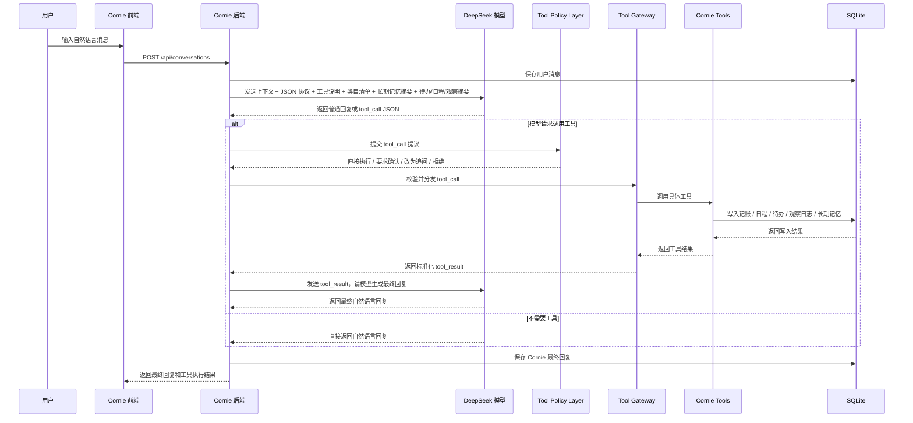

# Cornie 0625 模型侧改进设计

## 1. 文档信息

| 字段 | 内容 |
| --- | --- |
| 文档名称 | Cornie 0625 模型侧改进设计 |
| 文件名称 | Cornie-0625-模型侧改进设计.md |
| 产品名称 | Cornie（铃湾） |
| 文档编号 | Cornie-0625-model-improvement |
| 文档类型 | 设计变更 / 改进计划 |
| 文档版本 | V1.2 |
| 文档状态 | 草案 |
| 编写日期 | 2026-06-25 |
| 适用对象 | 产品 / 研发 / 测试 |
| 上游文档 | Cornie-4.2-技术架构-详细设计.md, Cornie-4.2.2-对话模块-详细设计.md |
| 下游文档 | 后端接口设计、工具设计、模型提示词与协议设计 |
| 关联规范 | ../../criterion/Cornie-backend-api规范.md |
| 存放目录 | doc/design/ |

### 1.1 修订记录

| 版本 | 日期 | 修订人 | 修订说明 |
| --- | --- | --- | --- |
| V1.0 | 2026-06-25 | Codex | 初始版本，定义从本地 Qwen 小模型迁移到 DeepSeek + 手写 JSON 工具协议的改进方向 |
| V1.1 | 2026-06-25 | Codex | 更新为 DeepSeek 唯一模型方案，补全工具穷举、类目确认、观察日志、长期记忆与 Cornie 日记链路 |
| V1.2 | 2026-06-25 | Codex | 补充摘要 + 工具混合上下文、Tool Policy Layer、Cornie 日记三源输入、观察日志去重策略、长期记忆 RAG 演进路径 |

## 2. 背景与目标

### 2.1 背景

Cornie 旧版本的模型设计以本地 `Ollama + qwen3.5` 为基础，只能完成有限的对话和日记生成，难以承担工具调用、类目映射、长期记忆、待办日程联动等复杂业务。

本次改进明确采用以下产品前提：

- 不再支持本地模型，统一只支持 DeepSeek。
- AI 可调用的工具层必须与人类前端可操作能力对齐。
- 涉及类目映射的业务必须先看现有类目；无法映射时，只能提请人类确认新增类目。
- 观察日志是事实记录层，Cornie 日记是文学化关怀层。
- 长期记忆要参与每轮对话，但只能被选择性使用，避免恐怖谷效应。
- Cornie 自称“铃湾”或“小铃湾”。

### 2.2 改进目标

| 编号 | 目标 | 说明 |
| --- | --- | --- |
| G1 | 模型提供方统一切换为 DeepSeek | DeepSeek 作为唯一模型方案，用于对话、抽取、决策和最终回复 |
| G2 | 建立手写 JSON 工具协议 | 不依赖原生 tool calling，先把流程做稳做可控 |
| G3 | 建立全量工具层 | 人类前端可做的事，模型都能通过工具申请做同样的事 |
| G4 | 建立类目映射与新增确认机制 | 收入、支出、日程、待办等涉及类目的操作都要先映射现有类目 |
| G5 | 建立观察日志 -> Cornie 日记链路 | 日记不再直接从原始对话生成，而是从观察日志、人类日记、相关记忆综合生成 |
| G6 | 建立长期记忆机制 | 对偏好、厌恶、长期需求、特殊事件进行有节制的长期记忆 |
| G7 | 建立摘要 + 工具混合上下文策略 | prompt 放摘要，细节按需通过只读工具查询 |
| G8 | 建立 Tool Policy Layer | 让模型负责提议，让系统负责批准、确认、降级和拦截 |
| G9 | 为长期记忆预留 RAG 化演进路径 | 长期记忆不做成无限增长文档，而做成可检索记忆库 |

## 3. 核心原则

| 原则 | 说明 |
| --- | --- |
| 模型不直接执行副作用 | DeepSeek 只输出 JSON 决策，真实写库、删改数据、联网都由后端执行 |
| 工具调用必须可校验 | 工具参数必须经过后端校验，不能直接信任模型输出 |
| 人类可做即 AI 可申请 | 前端所有可见操作都必须有对应工具 |
| 类目新增必须经人确认 | 模型可提出新增类目请求，但不能自行创建 |
| 观察日志与日记分离 | 观察日志记录事实，日记负责文学化表达和人文关怀 |
| 长期记忆默认弱使用 | 每轮都可注入，但模型只能在相关时选择性使用 |
| 摘要进 prompt，细节靠工具 | prompt 只带摘要，完整待办、完整日程、完整历史由工具按需读取 |
| 模型负责提议，系统负责批准 | 工具执行前必须经过 Tool Policy Layer 判断 |
| Cornie 口吻统一 | 回复中自称“铃湾”或“小铃湾” |

## 4. 总体架构

### 4.1 调整后流程



## 5. 后端接口改进

后端负责：接收对话、拼装 prompt、调用 DeepSeek、解析 JSON、执行策略、调用工具、保存结果。

| 优先级 | 改进项 | 说明 |
| --- | --- | --- |
| P0 | 移除本地模型主链路 | 文档与实现都不再把本地模型作为正式方案 |
| P0 | 新增 DeepSeek 客户端 | 支持 API Key、base URL、超时、错误处理、非流式回复 |
| P0 | 新增 JSON 解析器 | 处理纯 JSON、代码块 JSON、非法 JSON 修复 |
| P0 | 新增 Tool Gateway | 统一校验、分发、执行工具调用 |
| P0 | 新增 Tool Policy Layer | 在工具执行前做风险判断、确认流、降级与拦截 |
| P0 | 新增类目快照注入器 | 涉及收支/日程/待办时注入当前全部类目 |
| P0 | 新增长期记忆注入器 | 每轮对话注入长期记忆摘要或检索结果 |
| P0 | 新增观察日志摘要注入器 | 每轮按需给模型当前观察日志摘要，用于避免重复记录 |
| P1 | 新增只读检索接口 | 支持模型按需查询完整待办、完整日程、完整观察日志和记忆检索命中结果 |
| P1 | 新增审计日志 | 保存每次 tool_call 的输入、输出与状态 |

### 5.1 对话流程

```text
1. 保存用户消息。
2. 读取当日对话上下文。
3. 读取当前类目清单、长期记忆摘要、未完成待办摘要、近期日程摘要、今日观察日志摘要。
4. 构造模型提示词。
5. 调用 DeepSeek。
6. 若是普通回复：保存并返回。
7. 若是 tool_call：先进入 Tool Policy Layer。
8. Tool Policy Layer 判断是直接执行、要求确认、改为追问，还是拒绝。
9. 若允许执行：校验参数，调用工具。
10. 若涉及新增类目：先返回待确认请求，不直接创建。
11. 将工具结果再次发给 DeepSeek，生成最终回复。
12. 保存最终回复并返回前端。
```

## 6. 工具层设计

工具层和人类前端功能对齐，按“人类能做什么，AI 就能通过工具申请做什么”来设计。

### 6.1 能力对齐总表

| 功能域 | 人类前端能力 | 工具层要求 |
| --- | --- | --- |
| 收入/支出 | 新增、编辑、删除、查询、分类、统计 | AI 等价支持 |
| 收入/支出类目 | 新增、编辑、删除、查询、启停 | AI 可申请，但新增必须确认 |
| 待办事项 | 新增、编辑、完成、删除、查询、分类 | AI 等价支持 |
| 待办类目 | 新增、编辑、删除、查询 | AI 可申请，但新增必须确认 |
| 日程 | 新增、编辑、取消、删除、查询、分类 | AI 等价支持 |
| 日程类目 | 新增、编辑、删除、查询 | AI 可申请，但新增必须确认 |
| 观察日志 | 新增、编辑、删除、查询 | AI 等价支持 |
| Cornie 日记 | 手动生成、定时生成、重新生成、查看、编辑 | AI 可触发生成 |
| 长期记忆 | 新增、编辑、删除、查询 | AI 可申请，使用要克制 |
| 设置与状态 | 查询配置、类目、记忆、运行状态 | AI 至少要有只读工具 |

### 6.2 工具清单

#### 6.2.1 收支相关

| 工具名 | 优先级 | 功能 |
| --- | --- | --- |
| `ledger.add_expense` | P0 | 新增支出记录 |
| `ledger.add_income` | P0 | 新增收入记录 |
| `ledger.update_entry` | P1 | 修改记账记录 |
| `ledger.delete_entry` | P1 | 删除记账记录 |
| `ledger.get_entry` | P1 | 查看单条记账 |
| `ledger.list_today` | P1 | 查看今日收支 |
| `ledger.list_by_range` | P1 | 查看时间范围收支 |

#### 6.2.2 收支类目相关

| 工具名 | 优先级 | 功能 |
| --- | --- | --- |
| `ledger_category.list_expense` | P0 | 获取全部支出类目 |
| `ledger_category.list_income` | P0 | 获取全部收入类目 |
| `ledger_category.create_expense` | P0 | 新增支出类目，需确认 |
| `ledger_category.create_income` | P0 | 新增收入类目，需确认 |
| `ledger_category.update` | P1 | 修改类目 |
| `ledger_category.delete` | P1 | 删除类目 |

#### 6.2.3 待办相关

| 工具名 | 优先级 | 功能 |
| --- | --- | --- |
| `todo.create` | P0 | 新增待办 |
| `todo.update` | P1 | 修改待办 |
| `todo.complete` | P1 | 完成待办 |
| `todo.delete` | P1 | 删除待办 |
| `todo.get` | P1 | 查看单条待办 |
| `todo.list_today` | P1 | 查看今日待办 |
| `todo.list_by_range` | P1 | 查看时间范围待办 |

#### 6.2.4 待办类目相关

| 工具名 | 优先级 | 功能 |
| --- | --- | --- |
| `todo_category.list` | P0 | 获取待办类目 |
| `todo_category.create` | P0 | 新增待办类目，需确认 |
| `todo_category.update` | P1 | 修改待办类目 |
| `todo_category.delete` | P1 | 删除待办类目 |

#### 6.2.5 日程相关

| 工具名 | 优先级 | 功能 |
| --- | --- | --- |
| `schedule.create` | P0 | 新增日程 |
| `schedule.update` | P1 | 修改日程 |
| `schedule.cancel` | P1 | 取消日程 |
| `schedule.delete` | P1 | 删除日程 |
| `schedule.get` | P1 | 查看单条日程 |
| `schedule.list_today` | P1 | 查看今日日程 |
| `schedule.list_by_range` | P1 | 查看时间范围日程 |

#### 6.2.6 日程类目相关

| 工具名 | 优先级 | 功能 |
| --- | --- | --- |
| `schedule_category.list` | P0 | 获取日程类目 |
| `schedule_category.create` | P0 | 新增日程类目，需确认 |
| `schedule_category.update` | P1 | 修改日程类目 |
| `schedule_category.delete` | P1 | 删除日程类目 |

#### 6.2.7 观察日志与日记

| 工具名 | 优先级 | 功能 |
| --- | --- | --- |
| `observation.add_note` | P0 | 新增观察日志 |
| `observation.update_note` | P1 | 修改观察日志 |
| `observation.delete_note` | P1 | 删除观察日志 |
| `observation.get` | P1 | 查看单条观察日志 |
| `observation.list_today` | P1 | 查看今日观察日志 |
| `observation.list_by_range` | P1 | 查看时间范围观察日志 |
| `diary.generate_from_observations` | P0 | 由观察日志、人类日记和相关记忆生成 Cornie 日记 |
| `diary.get_entry` | P1 | 查看日记 |
| `diary.update_entry` | P1 | 编辑日记 |

#### 6.2.8 长期记忆相关

| 工具名 | 优先级 | 功能 |
| --- | --- | --- |
| `memory.create` | P0 | 新增长期记忆 |
| `memory.update` | P1 | 修改长期记忆 |
| `memory.delete` | P1 | 删除长期记忆 |
| `memory.list_active` | P0 | 获取长期记忆摘要 |
| `memory.search` | P1 | 按主题、关键词或相似语义检索长期记忆 |

#### 6.2.9 设置与状态

| 工具名 | 优先级 | 功能 |
| --- | --- | --- |
| `settings.get_runtime_context` | P1 | 获取当前策略、限制、类目和模型配置 |
| `health.get_model_status` | P1 | 检查 DeepSeek 接入状态 |

## 7. 类目映射与新增确认

### 7.1 规则

收入、支出、待办、日程等涉及类目的操作，模型必须先拿到当前全部类目再做匹配。

| 场景 | 模型行为 | 后端行为 |
| --- | --- | --- |
| 能映射到现有类目 | 返回类目 ID 或名称 | 校验并执行 |
| 有多个候选类目 | 选最优类目并说明理由 | 视置信度决定是否自动执行 |
| 无法映射 | 返回“需要新增类目”请求 | 转为人类确认，不直接落库 |
| 人类同意新增类目 | 再调用类目创建工具 | 创建后重试原动作 |
| 人类拒绝新增类目 | 选择替代类目或未分类 | 不擅自创建 |

### 7.2 注入示例

```json
{
  "ledger_categories": {
    "expense": [
      { "id": "exp_food", "name": "餐饮" },
      { "id": "exp_transport", "name": "交通" }
    ],
    "income": [
      { "id": "inc_salary", "name": "工资" }
    ]
  },
  "todo_categories": [
    { "id": "todo_work", "name": "工作" },
    { "id": "todo_life", "name": "生活" }
  ],
  "schedule_categories": [
    { "id": "sch_meeting", "name": "会议" },
    { "id": "sch_personal", "name": "个人安排" }
  ]
}
```

### 7.3 新增类目请求示例

```json
{
  "type": "tool_call",
  "assistant_reply": "小铃湾觉得这笔像新的支出类目，想先问问主人可不可以新增。",
  "tool_calls": [
    {
      "tool_name": "ledger_category.create_expense",
      "requires_confirmation": true,
      "arguments": {
        "name": "宠物用品",
        "reason": "当前支出类目中没有适合映射“给猫买罐头”的类目",
        "source_text": "我今天给猫买罐头花了89块"
      }
    }
  ]
}
```

## 8. JSON 协议

### 8.1 普通回复

```json
{
  "type": "reply",
  "assistant_reply": "主人，小铃湾听到啦。"
}
```

### 8.2 工具调用

```json
{
  "type": "tool_call",
  "assistant_reply": "我先帮主人记下来。",
  "tool_calls": [
    {
      "tool_name": "ledger.add_expense",
      "arguments": {
        "amount": 28,
        "currency": "CNY",
        "category": "餐饮",
        "item": "咖啡",
        "merchant": "未知",
        "occurred_at": "2026-06-25T14:30:00+08:00",
        "source_text": "我今天买咖啡花了28块",
        "confidence": 0.92
      }
    },
    {
      "tool_name": "observation.add_note",
      "arguments": {
        "date": "2026-06-25",
        "type": "expense",
        "title": "购买咖啡",
        "content": "主人今天买咖啡花了28元。",
        "related_tool": "ledger.add_expense",
        "source_text": "我今天买咖啡花了28块"
      }
    }
  ]
}
```

### 8.3 需要追问

```json
{
  "type": "reply",
  "assistant_reply": "主人，这笔我可以帮你记下来，不过金额是多少呀？"
}
```

### 8.4 工具结果回传

```json
{
  "type": "tool_result",
  "results": [
    {
      "tool_name": "ledger.add_expense",
      "ok": true,
      "result": {
        "id": "expense_001",
        "amount": 28,
        "currency": "CNY",
        "category": "餐饮",
        "item": "咖啡"
      }
    },
    {
      "tool_name": "observation.add_note",
      "ok": true,
      "result": {
        "id": "obs_001",
        "date": "2026-06-25"
      }
    }
  ]
}
```

## 9. 观察日志、Cornie 日记与长期记忆

### 9.1 三层记录模型

| 层级 | 定位 | 来源 | 风格 | 用途 |
| --- | --- | --- | --- | --- |
| 观察日志 | 事实记录层 | AI 与人类每轮对话中按需写入 | 客观、简洁、如实 | 记录事件、状态、消费、计划、承诺 |
| Cornie 日记 | 人文关怀层 | 由当天观察日志、人类日记、相关长期记忆共同生成 | 铃湾/小铃湾口吻、文学化、温柔 | 每日陪伴、情感价值、回顾 |
| 长期记忆 | 长期偏好层 | AI 按需申请写入 | 结构化、克制 | 保存偏好、厌恶、长期需求、重要人事物 |

### 9.2 观察日志规则

应记录：

- 明确事实事件
- 明确计划和承诺
- 财务行为
- 显著状态变化

不必记录：

- 纯寒暄
- 低信息量回应
- 没有事实价值的闲聊

观察日志写入前，模型应先看到“今日观察日志摘要”，并判断当前信息属于哪一类：

| 判断结果 | 处理方式 |
| --- | --- |
| 新事实 | 新增观察日志 |
| 对已有事实的补充 | 更新已有观察日志 |
| 高度重复且无新增信息 | 不记录 |

这样可以在保持“每轮按需记录”的前提下，避免低价值重复日志。

### 9.3 Cornie 日记规则

Cornie 日记的输入由三部分组成：

- 当天观察日志
- 人类日记
- 与当天主题相关的长期记忆摘要

| 生成模式 | 说明 |
| --- | --- |
| 定时生成 | 每天固定时间自动生成 |
| 手动生成 | 人类主动触发 |
| 重新生成 | 人类对结果不满意时重试 |

文风要求：

- 第一人称
- 自称铃湾或小铃湾
- 温柔、文学化、克制
- 不能虚构当天观察日志和人类日记中没有的核心事实
- 长期记忆只能辅助理解“今天”，不能盖过“今天”

生成策略：

- 后端只做轻量整理，不做复杂语义去重和优先级筛选
- 按时间顺序整理当天观察日志
- 拼入人类日记原文
- 拼入相关长期记忆摘要
- 由 DeepSeek 自行消化并生成日记

### 9.4 长期记忆规则

应写入长期记忆：

- 明显偏好
- 明显厌恶
- 长期需求
- 特别事件

不应轻易写入：

- 一次性情绪
- 含糊表达
- 临时偏好

使用原则：

- 每轮都带入
- 只在相关时使用
- 避免机械复述
- 避免恐怖谷效应

自然度约束：

- 单轮回复最多自然引用 0-1 条长期记忆
- 非当前话题相关不得主动提起
- 不使用“我记得你在某年某月某日说过”这类监控感表达

### 9.5 上下文装载策略

为了兼顾业务覆盖率和 prompt 长度，采用“摘要进 prompt + 工具按需查”的混合策略：

| 内容 | 进入 prompt 方式 | 说明 |
| --- | --- | --- |
| 当前类目 | 全量注入 | 数量通常可控，必须完整给模型 |
| 长期记忆 | 摘要注入 | 只给高权重、当前相关的记忆摘要 |
| 未完成待办 | 摘要注入 | 只给标题、截止时间、类目、状态摘要 |
| 近期日程 | 摘要注入 | 只给近期未完成或临近事件摘要 |
| 观察日志 | 摘要注入 | 只给当天或近期关键事实摘要 |
| 详细待办/日程/历史 | 通过只读工具查 | 模型如需细节可自行查阅 |

推荐策略：

- 默认把摘要放进 prompt，保证常见场景的首轮命中率。
- 当摘要不足以判断类目或上下文时，模型可调用只读工具补查。
- 这样既能提高覆盖率，也不会让 prompt 过长。

建议进入 prompt 的摘要：

- 当前全部类目
- 长期记忆摘要
- 未完成待办摘要
- 近期未完成或临近的日程摘要
- 今日观察日志摘要
- 最近几轮对话摘要

### 9.6 轮次控制与通信上限

工具调用会带来模型与后端的往返通信，这是标准 agent 流程，可以实现，但必须限制轮次。

建议规则：

| 规则 | 说明 |
| --- | --- |
| 最多 1 次工具调用主回合 | 用户一次输入，默认最多允许一轮工具调用 |
| 最多 1 次修复重试 | JSON 解析失败时，只允许模型修复一次 |
| 最多 1 次补充查询 | 若工具结果不足，可再做一次只读补查 |
| 超限直接兜底 | 超过上限后，模型必须追问或返回失败提示 |

这样可以避免：

- 工具来回无限循环
- prompt 过长导致成本上升
- 业务流程失控

### 9.7 Tool Policy Layer

Tool Policy Layer 的职责是：不要让模型一拿到工具就直接执行，而是在执行前先做一次业务判断。

职责定义：

1. 判断模型提议的工具调用是否允许执行。
2. 决定是直接执行、要求确认、改为追问，还是拒绝。
3. 控制风险、轮次和副作用边界。

#### 9.7.1 风险分级

| 风险级别 | 典型工具 | 默认策略 |
| --- | --- | --- |
| 低风险 | 各类 `list` / `get` 查询工具 | 可直接执行 |
| 中风险 | 新增收支、待办、日程、观察日志 | 参数完整且置信度高时可直接执行 |
| 高风险 | 删除数据、改类目、新增类目、写长期记忆 | 默认要求确认或二次判断 |

#### 9.7.2 条件校验示例

| 工具 | 最低条件 |
| --- | --- |
| `ledger.add_expense` | 必须有金额、时间、可映射类目或新增类目确认 |
| `ledger.add_income` | 必须有金额、时间、可映射类目或新增类目确认 |
| `memory.create` | 必须是稳定偏好、长期需求、显著厌恶或重大事件 |
| `observation.add_note` | 不能和今日已有观察日志高度重复且无增量 |

#### 9.7.3 自动降级

当模型提议的动作过强时，策略层可以自动降级：

| 模型提议 | 策略层改写 |
| --- | --- |
| 直接写账 | 改成先查已有信息或追问 |
| 直接新增类目 | 改成确认请求 |
| 直接写长期记忆 | 改成待确认或不写入 |
| 连续多次写操作 | 降为只保留第一主动作，其余转追问或下轮再做 |

#### 9.7.4 确认流

适合走确认流的场景：

- 新增类目
- 删除数据
- 修改历史账目
- 写入长期记忆
- 低置信度的财务记录

确认流不是工具失败，而是系统有意识地把决定权交还给人类。

### 9.8 长期记忆与 RAG 演进

长期记忆不建议做成一份无限增长的长文本，而应设计成“可检索的记忆库”。

这里预留 RAG 演进路径：

| 阶段 | 方案 | 说明 |
| --- | --- | --- |
| MVP | 结构化记忆 + 关键词/标签检索 | 先不引入复杂向量库，也能跑起来 |
| V1 | 结构化记忆 + 轻量语义检索 | 可增加 embedding 和相似度召回 |
| V2 | 完整 RAG 记忆层 | 记忆检索、重排序、摘要压缩更成熟 |

在 Cornie 里，RAG 可以简单理解为：

- 先把长期记忆存成一条条结构化记录
- 对话时不把全部记忆都塞给模型
- 而是先检索出相关的几条，再放进 prompt

这比“整份长期记忆文档全塞进去”更稳、更省 token，也更自然。

## 10. 数据模型建议

### 10.1 收支表

```sql
CREATE TABLE IF NOT EXISTS ledger_entries (
  id TEXT PRIMARY KEY,
  occurred_at TEXT NOT NULL,
  amount REAL NOT NULL,
  currency TEXT NOT NULL,
  category TEXT,
  merchant TEXT,
  item TEXT,
  source_text TEXT,
  confidence REAL,
  created_at INTEGER NOT NULL
);
```

### 10.2 观察日志表

```sql
CREATE TABLE IF NOT EXISTS observation_logs (
  id TEXT PRIMARY KEY,
  date TEXT NOT NULL,
  type TEXT NOT NULL,
  title TEXT NOT NULL,
  content TEXT NOT NULL,
  related_ref TEXT,
  source_text TEXT,
  created_at INTEGER NOT NULL
);
```

### 10.3 长期记忆表

```sql
CREATE TABLE IF NOT EXISTS memory_entries (
  id TEXT PRIMARY KEY,
  kind TEXT NOT NULL,
  title TEXT NOT NULL,
  content TEXT NOT NULL,
  weight REAL DEFAULT 1.0,
  source_text TEXT,
  is_active INTEGER NOT NULL DEFAULT 1,
  last_used_at INTEGER,
  archived_at INTEGER,
  superseded_by TEXT,
  summary_group TEXT,
  created_at INTEGER NOT NULL,
  updated_at INTEGER NOT NULL
);
```

建议机制：

- 长时间未使用的记忆降权
- 被新偏好覆盖的旧记忆转归档
- 同主题记忆可合并为摘要型记忆
- 归档记忆默认不进 prompt，只在检索命中时使用

### 10.4 工具审计表

```sql
CREATE TABLE IF NOT EXISTS tool_call_logs (
  id TEXT PRIMARY KEY,
  date TEXT NOT NULL,
  conversation_message_id TEXT,
  tool_name TEXT NOT NULL,
  arguments_json TEXT NOT NULL,
  result_json TEXT,
  status TEXT NOT NULL,
  error_message TEXT,
  created_at INTEGER NOT NULL
);
```

## 11. DeepSeek 接入

### 11.1 配置项

| 配置项 | 说明 |
| --- | --- |
| `DEEPSEEK_API_KEY` | DeepSeek API Key，不写入代码仓库 |
| `DEEPSEEK_BASE_URL` | 默认 DeepSeek 官方 API |
| `DEEPSEEK_MODEL` | 当前使用的 DeepSeek 模型 |

### 11.2 隐私说明

从本地模型切换到 DeepSeek 后，用户对话内容会发送到云端模型服务，因此需要明确提示：

| 项目 | 新设计 |
| --- | --- |
| 模型推理位置 | DeepSeek 云端唯一方案 |
| 隐私承诺 | 需要明确告知模型请求会发送给 DeepSeek |
| 敏感数据处理 | 财务数据写入本地，但识别用对话会进入模型请求 |
| 用户控制 | 需要提供隐私确认与 API 配置项 |

## 12. 分阶段计划

### 12.1 第一阶段：DeepSeek 单模型接入

| 任务 | 优先级 | 验收标准 |
| --- | --- | --- |
| 新增 DeepSeek 客户端 | P0 | 可完成普通对话回复 |
| 移除本地模型主链路 | P0 | 设计不再依赖 Ollama |
| 更新文档假设 | P0 | 文档明确 DeepSeek 是唯一模型 |
| 增加 API 健康检查 | P1 | 可检测 DeepSeek 可用性 |

### 12.2 第二阶段：JSON 协议与解析器

| 任务 | 优先级 | 验收标准 |
| --- | --- | --- |
| 编写工具协议 prompt | P0 | 模型能输出 `reply` 或 `tool_call` |
| 编写 JSON 解析器 | P0 | 能处理各种 JSON 包装形式 |
| 增加格式错误重试 | P1 | 解析失败可要求模型修复一次 |
| 增加工具审计日志 | P1 | 每次调用可追溯 |

### 12.3 第三阶段：工具全量对齐与策略层

| 任务 | 优先级 | 验收标准 |
| --- | --- | --- |
| 完成收支工具 | P0 | 收支可增删改查 |
| 完成类目工具 | P0 | 类目可查、可新增、可确认 |
| 完成待办工具 | P0 | 待办可增删改查 |
| 完成日程工具 | P0 | 日程可增删改查 |
| 完成观察日志工具 | P0 | 观察日志可增删改查 |
| 完成长记忆工具 | P0 | 长期记忆可增删改查 |
| 完成 Tool Policy Layer | P0 | 可控制确认、降级、拒绝和轮次上限 |

### 12.4 第四阶段：Cornie 日记、记忆检索与体验收口

| 任务 | 优先级 | 验收标准 |
| --- | --- | --- |
| 由观察日志、人类日记和相关记忆生成日记 | P0 | 日记输入切换完成 |
| 增加日记定时生成 | P1 | 每天可自动生成 |
| 日记口吻统一为铃湾/小铃湾 | P0 | 不再使用湾湾 |
| 增加长期记忆管理入口 | P1 | 可查看与管理记忆 |
| 增加工具执行结果展示 | P1 | 用户能看到执行结果 |
| 增加轻量记忆检索 | P1 | 不把全部长期记忆直接塞进 prompt |

## 13. 风险与应对

| 风险 | 影响 | 应对 |
| --- | --- | --- |
| JSON 输出不稳定 | 工具调用失败 | 严格 prompt + 容错解析 + 一次修复重试 |
| 类目误判 | 错误分类 | 注入完整类目清单，无法映射时必须确认 |
| 记账误写 | 用户不信任 | 置信度判断、追问确认、审计日志 |
| 长期记忆过度使用 | 恐怖谷体验 | 弱使用策略，控制引用频率 |
| 长期记忆无限增长 | prompt 膨胀、检索失真 | 做归档、压缩和分层检索，逐步引入 RAG |
| 云模型隐私变化 | 产品定位变化 | 明确说明并提供确认流程 |
| 工具被注入污染 | 数据安全风险 | 白名单工具、白名单字段、参数校验 |

## 14. 设计结论

1. Cornie 不再支持本地模型，DeepSeek 是唯一模型方案。
2. 工具层必须与人类前端能力对齐。
3. 收支、待办、日程等涉及类目的动作都要先做类目映射。
4. 映射失败时，模型只能提出新增类目请求，不能自行创建。
5. 每次记账和相关操作时，都要把当前类目清单带给模型。
6. prompt 采用“摘要进 prompt，细节靠工具”的混合策略，未完成待办与近期日程也要以摘要形式参与上下文。
7. 工具调用属于标准 agent 往返流程，但必须限制轮次，避免无限通信。
8. Tool Policy Layer 用来控制高风险工具、确认流、自动降级和执行边界。
9. 观察日志是事实层，Cornie 日记由当天观察日志、人类日记和相关长期记忆共同生成。
10. 长期记忆要按需写入、每轮注入、克制使用，并预留 RAG 化演进路径。
11. Cornie 自称铃湾或小铃湾。

---

**文档结束**
