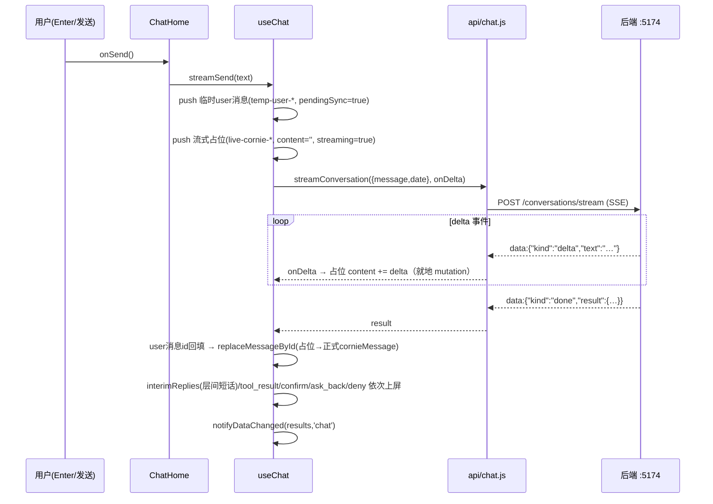
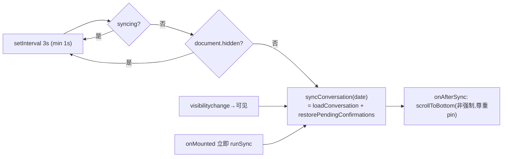

# Chat 模块重写规格

> 前置盘点文档 · 目标技术栈：React + TypeScript + Mantine 9（Electron 壳不变）
> 基线：`src/renderer/`（Vue 3 `<script setup>` + reka-ui 基础件 + 自研 CSS 变量主题）
> 本文档只描述现状与映射建议，不含任何源码改动。

---

## 1. 组件清单与职责

### 1.1 路由与接线（重写前必须理解的上下文）

- 路由（`router.js`，hash 模式，兼容 Electron `file://`）：
  - `/chat` → `ChatHome`
  - `/chat/history` → `ChatHistory`
  - `/chat/day/:date?focus=<messageId>` → `ChatDayView`（props 由路由解析：`date`、`focusMessageId = route.query.focus`）
  - `/` 与未知路径兜底 redirect 到 `/chat`
- `App.vue`（~404 行）是壳层：左侧导航 + 顶栏 + `RouterView`，并把统一事件接成 `router.push`：
  - `go-history` → `/chat/history`；`open-date` → `/chat/day/:date`；`back` 按当前路径逐级回退（day→history→chat）。
  - React 重写建议直接用 React Router 对应嵌套路由 + `useNavigate`，事件接线不再需要（组件内部导航即可）。
- 视图切换后 `App.vue` 会把焦点落到 `main` 容器（`tabindex="-1"`，FE-10 键盘可达性），重写需保留。

### 1.2 组件

| 文件 | 行数 | 职责 | 主要依赖 |
|---|---|---|---|
| `components/ChatHome.vue` | 400 | 聊天主页：顶部陪伴条（问候语/日期/跳历史按钮）、消息流（5 种消息形态渲染）、「正在思考」占位、回到底部按钮、内联输入框（Enter 发送 + 自增高）、待确认条。持有滚动锚底状态机（pin/未读）。挂载时加载当日会话 + 恢复 pending 确认卡 + 启动 3s 轮询同步。 | `useChat`、`utils/date.today`、`UiButton`、`UiEmpty`、`ConfirmCard`、`AskBackBubble`、`ToolResultPanel` |
| `ChatHistory.vue`（**在 renderer 根目录，不在 components/**） | 567 | 聊天历史页：双栏布局（280px 日期侧栏 + 当日消息区）。侧栏含范围选择（全部/最近30天/指定月份）、月份下拉、关键词搜索、日期分页「查看更多」；右侧含当日消息分页、命中预览、导出（当日 TXT / 本月 JSON，Blob+`a.download` 客户端下载）、「查看这一天」跳日视图。唯一使用 `useRequestGuard` 防竞态的聊天页面。 | `api`（listChatlogDates/getChatlog/export×2）、`useRequestGuard`、`UiButton` |
| `components/ChatDayView.vue` | 224 | 单日回顾视图：按 `date` prop 拉全天消息；支持 `focusMessageId` 定位并高亮（`scrollIntoView({behavior:'smooth',block:'center'})` + 光环 box-shadow）；用函数式 ref 的 `Map` 收集消息 DOM。 | `api.getChatlog`、`UiButton`、`UiEmpty` |
| `CornieComposer.vue`（**在 renderer 根目录**） | 451 | ⚠️ 名字有误导：**不是聊天输入组件**，是 Cornie 桌宠「拼装编辑器」（固化头/身体/铃铛/尾巴贴图 + 眼睛覆盖层指针拖拽/缩放 + 眨眼预览 + 导出 JSON/CSS 变量到剪贴板）。**未被 router.js 引用，也无任何 import**——死代码/开发工具。聊天输入实际是 ChatHome 内联 `<textarea>`。 | `cornieBlink`、`cornieConfig`（纯本地，无 API） |
| `components/AskBackBubble.vue` | 59 | 纯展示：反问气泡（`question` + 可选 `reason`），浅 accent 底色。 | 无 |
| `components/ConfirmCard.vue` | 205 | 确认卡：状态徽标（pending/approved/rejected/failed/processing）、标题/原因/**多态详情推断**（按 `request.kind`：`category_creation_confirmation` / `category_mapping_confirmation` / 通用 `payload‖arguments` 键值对）、错误信息、同意/拒绝按钮（仅 pending 可点，processing 显示「处理中」）。emit `confirm`/`reject`（携带 request）。 | `UiButton` |
| `components/ToolResultPanel.vue` | 186 | 工具执行结果卡列表：每条结果渲染 ✓/! 图标、成败标题（`tool_name` 前缀→中文标签：ledger→记账、todo→待办、schedule→日程、category→类目、memory→记忆）、摘要兜底链、原文回显（`source_text`/`sourceText`）。 | 无 |
| `components/ui/UiButton.vue` | 31 | 自研按钮。variant：`default\|destructive\|outline\|secondary\|ghost\|link\|dangerGhost`；size：`default\|sm\|lg\|icon`。原生 `<button>` + Tailwind 任意值类（引用 CSS 变量）。`type`/`disabled` 靠 attrs 透传。 | `lib/utils.cn` |
| `components/ui/UiBadge.vue` | 20 | 自研徽标。variant：`default\|secondary\|destructive\|outline`，`<span>`。 | `cn` |
| `components/ui/UiCard.vue` | 73 | 通用卡片。props `title/subhint`；slots `head/actions/default`。 | 无 |
| `components/ui/UiDialog.vue` | 110 | 对话框：reka-ui `DialogRoot/Portal/Overlay/Content`，`v-model:open`，props `title/description`，`trigger` 具名插槽，内置 X 关闭按钮（lucide）。 | reka-ui、lucide-vue-next |
| `components/ui/UiScrollArea.vue` | 38 | 滚动区：reka-ui ScrollArea 包装（8px 竖向滚动条）。 | reka-ui |
| `components/ui/UiEmpty.vue` | 41 | 空态（ChatHome/ChatDayView 实际在用）：props `icon/text` + `action` 插槽，虚线边框卡片。 | 无 |

### 1.3 组合式函数与 API 层

| 文件 | 行数 | 职责 |
|---|---|---|
| `composables/useChat.js` | 386 | 聊天全部业务状态机：消息列表（5 种形态）、发送（流式/非流式统一骨架 `sendCore`）、占位/回填/去重（R-02）、确认卡动作、pending 恢复、当日会话轮询同步（防重入 + 可见性感知）、data-changed 信号发射。 |
| `composables/useRequestGuard.js` | 44 | 竞态守卫：`begin(key)` 递增 token 并 **abort 同 key 旧 AbortController**；回调前 `isCurrent(key,token)` 判活；卸载时 abort 全部。仅 `ChatHistory`（key=`'messages'`）使用。 |
| `composables/useTimers.js` | 59 | `useInterval`（自动清理，可 start/stop）、`useDebouncedValue`（watch + 延迟回调，卸载清除）。**聊天模块未使用**（仅 MemoryWikiHome / ObservationList 用了 debounce）。 |
| `api/chat.js` | 215 | 会话（含 SSE 流式）+ chatlog 查询/导出，见 §3。 |
| `api/confirm.js` | 20 | 确认决策/查询，见 §3。 |
| `api/shared.js` | 18 | `API_BASE = http://127.0.0.1:5174/api`（硬编码）+ `apiFetch` 统一入口（JSON 头、默认 30s 超时、204→null、`request()` 错误分类）。 |
| `request.js`（被 chat 依赖） | 174 | 超时/Abort 合并（`createAbortContext`/`raceWithAbort`）、`ApiError {kind: network\|timeout\|http\|protocol, status?, message}`、`createHttpError`（错误信息取响应体 `error` 字段→文本→`HTTP xxx`）。 |
| `syncSignals.js`（被 useChat 依赖） | 65 | `data-changed` 信号：`collectChangedDomains`（tool_name 前缀→5 域布尔）+ `emitDataChanged`（window CustomEvent `cornie:data-changed` + `window.cornieDesktop.broadcastDataChanged` 跨窗口 IPC）+ `listenDataChanged`（含一次性绑定远端 `cornieDesktop.onDataChanged` 回注）。 |
| `utils/date.js`（被 useChat 依赖） | 51 | `today()` = 本地时区 `YYYY-MM-DD`（注释明确禁止 `toISOString()`，UTC 跨日错位）。 |

### 1.4 ⚠️ 已发现的平行 `.ts` 双轨

`src/renderer/api/` 下已存在 `chat.ts / confirm.ts / shared.ts / diary.ts …`、`request.ts`、`utils/date.ts`、`theme/theme.ts`——是 `.js` 版的**直译 TypeScript 移植**（已抽查 `chat.ts`：路径/字段/归一化逻辑与 `.js` 完全一致）。当前组件统一从 `api/index.js`（桶导出）引入，**运行时走 `.js`**。重写时必须确定唯一事实源，警惕两份文件后续漂移（见 §6）。

---

## 2. 状态与交互流

### 2.1 前端消息模型（重写为 TS discriminated union 的核心）

`useChat.messages: ref<Item[]>`，`Item` 按 `kind` 分五态，均带稳定 `id`（无 id 时生成 `${kind}-${Date.now()}-${random}`）：

```ts
type ChatItem =
  | { kind: 'message'; id; role: 'user'|'cornie'; content; pendingSync?; streaming?; error?; interim? }
  | { kind: 'tool_result'; id; results: ToolResultItem[] }
  | { kind: 'confirm'; id; request; pendingConfirmationId; status: 'pending'|'approved'|'rejected'|'failed'|'processing'; errorMessage }
  | { kind: 'ask_back'; id; question; reason }
  | { kind: 'error'; id; content }
```

关键变更原语（React 重写须等价实现）：
- `pushChatItem(item)`：追加（id 兜底生成）。
- `replaceMessageById(id, patch)`（**R-02 upsert 语义**）：合并 patch 后**先移除所有同 id 旧项再追加到尾部**——保证同 id 不并存（解决「轮询拉到正式消息 vs 流式占位替换」竞态）。
- `hasEquivalentMessage(msg)`（**R-02 去重**，轮询收敛的核心）：
  1. 同 `id` → 等价；
  2. 双方都是 cornie 消息 → **仅按 role+content 去重**（放宽，覆盖「轮询拉到 DB 正式消息 vs 本地流式占位已累积到同内容」）；
  3. 否则要求本地项 `pendingSync === true` 且 role/content 相同（用户回显场景）。
- `setConfirmMessageState(id, patch)`：按引用 `Object.assign`（React 需改为不可变 map/patch）。

### 2.2 会话加载（ChatHome 挂载序列）

```
onMounted:
  loadConversation(today())            // GET /conversations/:date，逐条 hasEquivalentMessage 去重后上屏
  → restorePendingConfirmations(today) // GET /confirmations?date&status=pending，按 pendingConfirmationId 去重补卡
  → scrollToBottom(force=true)         // hasInitializedScroll=true 之后 watch(messages.length) 才参与锚底
  → startConversationSync(today, { onAfterSync: scrollToBottom })
onBeforeUnmount: stopConversationSync()
```

加载/恢复失败均**静默吞掉**（catch 忽略），无错误 UI。

### 2.3 发送与流式渲染（`sendCore(text, {stream})`，统一骨架）



逐步规格（必须原样保留）：
1. **单飞守卫**：`!text || sending` 直接返回；`sending=true` 直到 finally（流式期间全页禁发，发送按钮 disabled）。
2. **占位**：先推临时 user 消息（`pendingSync:true`）；流式再推 cornie 占位（`streaming:true`，content 空）。
3. **流式**：`streamConversation` 内解析 SSE `data:` 行（坏行丢弃、半截行尾包处理、`kind:'error'`/流提前结束→`ApiError('protocol')`、无 body→protocol）；`onDelta` 直接 `target.content += delta`（Vue 可变；React 需 setState/累加缓冲，见 §5）。
4. **成功回填**：`data.userMessage.id` → `replaceMessageById(tempId,{id, pendingSync:false})`；`appendResponse(data,{replaceId:liveId})`：
   - `interimReplies[]`（钻取层间短话）**先于**最终回复上屏（`interim:true`）；
   - 流式：占位替换为 `cornieMessage`（id/content，`streaming:false`）；占位替换失败（无 content）则标 `error:true`；
   - `toolExecution.used && results.length>0` → `tool_result` 项；
   - `policyDecision.decision`：`confirm`→确认卡（`request=policyDecision.confirmRequest`、`pendingConfirmationId=pendingConfirmation.id`、`status=pendingConfirmation.status`）；`ask_back`→反问气泡；`deny`→error 气泡（reason）。
5. **失败回退**：临时 user 消息标 `error:true`；流式路径把占位替换为固定文案「唔...我好像走神了，能再说一遍吗？」；非流式路径新推同文案 error 气泡。**无自动重试、无重试按钮**（用户重发即重试）。
6. 非流式 `send`（`sendMessage`）保留为回退，**当前 UI 未使用**（FE-03：主入口默认流式）。

### 2.4 确认卡动作（`handleConfirmAction(action, item)`）

1. 守卫：有 `pendingConfirmationId` 且 `status==='pending'`（天然防双击/防重复处理）。
2. 本地置 `status:'processing'` → `submitConfirmationDecision(id, approve|reject)`。
3. 成功：`status = result.confirmation.status || (action 映射)`；追加 `toolExecution.results`（如有）、`cornieMessage`（如有）、`followupConfirmation` → **新确认卡**（链式确认）；`notifyDataChanged(results,'confirmation')`。
4. 失败：`status:'failed'` + `errorMessage`（卡片内展示，可读 message）。

### 2.5 轮询同步（`startConversationSync`，FE-04）



- 防重入：`syncing` 闭包标志，慢响应不叠请求；**轮询请求不携带 AbortSignal**，收敛完全靠 §2.1 去重。
- 窗口隐藏时定时器照走但 `runSync` 直接跳过；恢复可见立即补一次。
- 每轮同步后 `hasEquivalentMessage` 去重保证流式占位与 DB 正式消息不重复；`onAfterSync` 的 `scrollToBottom()` 非强制（未 pin 时仅置未读标记）。
- 重写注意：等价物可用 `@mantine/hooks` 的 `useInterval` + `useDocumentVisibility` 组合，但防重入 ref 与清理逻辑需自写（React StrictMode 双挂载必须严格 cleanup）。

### 2.6 data-changed 同步信号（跨模块/跨窗口）

- **生产方**：useChat 在 `appendResponse`（source=`'chat'`）与确认动作（source=`'confirmation'`）后，`collectChangedDomains(toolResults)` 判定 5 个域（`ledger` / `todo` / `schedule` / `observation` / `memory`；按 `tool_name` 前缀 `ledger.*|ledger_category.*`、`todo.*|todo_category.*`、`schedule.*|schedule_category.*`、`observation.*`、`memory_wiki.*|memory_index.*|memory_governance.*`；跳过 `ok===false` 的失败结果），有变化才 `emitDataChanged({source, ...changed})`。
- **传输**：同窗口 window CustomEvent `cornie:data-changed`；同时 `window.cornieDesktop.broadcastDataChanged(detail)` → IPC `cornie:data-changed` → 主进程广播到其他窗口；其他窗口经 `cornieDesktop.onDataChanged` 订阅回注为本地 CustomEvent（`listenDataChanged` 内一次性绑定）。
- **消费方**：Ledger/Todo/Schedule/MemoryWiki/Observe 五个首页。Chat 自身**不消费**该信号（自己的刷新就是 3s 轮询）。
- 重写必须保持事件名与 payload 形状不变（`{source, ledger, todo, schedule, observation, memory}`）。

### 2.7 请求竞态守卫（useRequestGuard）

```
begin(key):            token = tokens[key]+1；abort 同 key 旧 controller；新建 controller
                       返回 { token, signal }（signal 透传给 getChatlog）
回调写状态前:           if (!isCurrent(key, token)) return   // 旧响应晚到直接丢弃
finally:               isCurrent 通过才复位 loading 并 end(key, token)
卸载(onBeforeUnmount):  abort 全部 controller、清空 tokens
```

- 覆盖场景：ChatHistory 快速切换日期/搜索词时旧 `getChatlog` 响应覆盖新视图（FE-05）。
- **范围**：仅 `ChatHistory` 的 `refreshMessages`（key=`'messages'`）在用；日期列表 `refreshDates/loadMoreDates` 与 ChatDayView、轮询均未接守卫。
- React 等价：`useRef` token + `AbortController` 的 latest-only hook（~40 行，资源清单无 react-query，需自写），或引入 react-query/SWR（超出本盘点授权，仅标注选项）。

### 2.8 滚动行为（ChatHome 锚底状态机）

- 状态：`isPinnedToBottom`（距底 ≤36px 视为贴底）、`hasUnreadBelow`、`hasInitializedScroll`。
- scroll 事件更新 pin；pin 时清除未读。新增消息 `watch(messages.length)` → `scrollToBottom()`：**pin 才真滚**，否则置 `hasUnreadBelow` 显示 sticky「回到底部」按钮（点击 force 滚动）。
- CSS `scroll-behavior: smooth` + 直接赋值 `scrollTop` 混用（force 滚也是平滑的）。
- 重写：Mantine `ScrollArea` 有 `viewportRef` 可拿 DOM，逻辑可平移；或 `@mantine/hooks` 的 `useScrollIntoView`/`useElementSize` 辅助。

### 2.9 聊天历史页数据流（ChatHistory）

- `watch(selectedMonth / selectedScope / searchQuery)` → `refreshDates()`（**searchQuery 每个字符都触发请求，无防抖**——useTimers 有现成 debounce 但未用，重写应加）。
- `watch(selectedDate)` → `refreshMessages(date)`（limit 80, cursor 0, q=searchQuery, signal=guard）。
- 分页按钮：`loadMoreDates`（limit=pageSize 60 起）/ `loadMoreMessages`（cursor=nextCursor 追加）。
- 当前列表里找不到选中日期时自动选第一条；`entries.length===0` 时清空消息。
- 导出：`exportSelectedDate('txt')` / `exportSelectedMonth('json')` → `downloadExportFile`（Blob + `<a download>`，payload 字段 `content/contentType/filename` 来自后端响应）。

---

## 3. API 契约清单

> 全部来自 `api/chat.js`、`api/confirm.js`、`api/shared.js` 逐函数提取（`.ts` 双轨已核对一致）。
> 传输层：`API_BASE = http://127.0.0.1:5174/api`（硬编码）；`apiFetch` 默认 JSON 头 + 30s 超时 + 204→`null`；错误统一 `ApiError{kind, message, status?}`，http 错误 message 取响应体 `error` 字段。

| 方法 | 路径 | 关键请求字段 | 关键响应字段 | 被哪个组件调用 |
|---|---|---|---|---|
| POST | `/conversations` | body `{ message, date }` | `userMessage{id}`、`cornieMessage{id,content}`、`interimReplies[]`、`toolExecution{used,results[]}`、`policyDecision{decision,confirmRequest,question,reason}`、`pendingConfirmation{id,status}` | `useChat.send`（非流式回退，当前 UI 未使用） |
| POST | `/conversations/stream` | body `{ message, date }`；SSE `data:` 行：`{kind:'delta',text}` / `{kind:'done',result}` / `{kind:'error',error}`；参数 `{signal, timeoutMs}`（默认 30s） | `done.result`（结构同上行）；协议错误抛 `ApiError('protocol')` | `useChat.streamSend` → `ChatHome.onSend` |
| GET | `/conversations/:date` | path `date`（本地时区 `YYYY-MM-DD`） | `messages[{id, role, content}]` | `useChat.loadConversation`（首载 + 每轮轮询） |
| DELETE | `/conversations/:date` | — | — | **当前无调用方**（已导出） |
| GET | `/chatlogs` | query `month, scope, q, limit, cursor` | `entries[{date, messageCount, matchedCount, matchedPreview}]`、`availableMonths[]`、`pagination{cursor,nextCursor,hasMore,pageSize,total}`、`filters`、`archiveScope`、`searchMeta{query,mode}`、`storage{driver,queryContractVersion}`、`meta` | `ChatHistory.refreshDates / loadMoreDates` |
| GET | `/chatlogs/:date` | query `limit, cursor, q, beforeId, mode`；`signal` 透传 | `messages`(=`items` 兜底)`[{id, role, content, matchedPreview}]`、`context{currentCursor,pageSize,total}`、`nextCursor`、`hasMore`、归一化 `pagination`、`meta{responseType: chatlog_day_page\|chatlog_day_record}`、`storage` | `ChatHistory.refreshMessages/loadMoreMessages`；`ChatDayView.loadMessages` |
| GET | `/chatlogs/search/snippets` | query `keyword, month, scope, limit, cursor` | `items[]`、`filters`、`pagination`、`storage`、`meta{responseType: chatlog_message_snippet_search}` | **当前无聊天组件调用**（预留导出） |
| GET | `/chatlogs/:date/export` | query `format` | `content`、`contentType`、`filename`（供 Blob 下载）、`meta{responseType: chatlog_day_export}` | `ChatHistory.exportSelectedDate`（txt） |
| GET | `/chatlogs/export/month/:month` | query `format` | 同上（`responseType: chatlog_month_export`） | `ChatHistory.exportSelectedMonth`（json） |
| POST | `/confirmations/:id/decision` | body `{ decision: 'approve'\|'reject' }` | `confirmation{status}`、`toolExecution{used,results[]}`、`cornieMessage{id,content}`、`followupConfirmation{id,confirmRequest,status}` | `useChat.handleConfirmAction` |
| GET | `/confirmations/:id` | — | confirmation 详情 | **当前无调用方**（已导出） |
| GET | `/confirmations` | query `date, status` | `confirmations[{id, confirmRequest, status}]` | `useChat.restorePendingConfirmations`（status='pending'） |

`toolExecution.results[]` 单项消费字段（ToolResultPanel / collectChangedDomains）：`ok`、`tool_name`（也容忍 `toolName`）、`summary` / `message` / `result.message` / `result.summary`、`source_text` / `sourceText`、`error`。

---

## 4. UI → Mantine 9 组件映射表

> 原则：优先 `@mantine/core` 现成组件；全局用 Mantine theme 承接现有 CSS 变量（`--surface/--border/--accent/--radius-*/--text-*` 可直接作为 theme token 值）。表内「关键 props」为必看项。

| 现有 UI 元素 / 自研组件 | 建议 Mantine 9 组件 + 关键 props | 备注 |
|---|---|---|
| `UiButton`（7 variant / 4 size） | `Button`：default→`variant="filled"`；destructive→`variant="filled" color="red"`；outline→`variant="default"`；secondary→`variant="light"`；ghost→`variant="subtle"`；link→`variant="subtle"`+下划线样式；dangerGhost→`variant="subtle" color="red"`；size default/sm/lg→`size="sm|xs|md"`；icon→`ActionIcon` | `loading`/`disabled` 内建；注意 Vue attrs 透传的 `type="button"` 需显式写 |
| `UiBadge` | `Badge`（`variant="light|outline|filled"` + `color` 映射，`radius="sm"`） | 直接替换 |
| `UiCard` | `Card`（`withPadding radius="xl"`）+ `Card.Section`；head/actions→`Group justify="space-between"`；title→`Title order={4}`，subhint→`Text size="sm" c="dimmed"` | head 具名插槽改受控 props/children |
| `UiDialog`（reka-ui） | `Modal`（`opened onClose centered title`；description→`Text c="dimmed"`；关闭按钮内建；trigger 插槽→受控 state） | 尺寸 `min(560px,…)`→`size="md"` |
| `UiScrollArea` | `ScrollArea`（`type="auto" scrollbarSize={8}`） | 聊天流需 `viewportRef` 拿 DOM 做锚底 |
| `UiEmpty` | `EmptyState`（Mantine 9）：`icon` + `description`；action 插槽→children 内放 Button | ChatHome/ChatDayView 空态 |
| ChatHome 顶部陪伴条 | `Group`（`align="baseline"`）+ `Text fw={700}` + `Text size="sm" c="dimmed"` + `Button variant="subtle"` | 「翻看以前聊天」 |
| 消息气泡（bubbleUser/bubbleCornie，max-width 75%、角半径不对称、pre-wrap） | 自研 `ChatBubble`：外层 `Box`/`Paper`（`bg`、`radius="lg"`）+ `Text size="xs" opacity={0.6}`（角色）+ `Text`（`style={{whiteSpace:'pre-wrap', overflowWrap:'anywhere'}}`） | Mantine 无聊天气泡；三个页面（ChatHome/ChatHistory/ChatDayView）各手写了一份几乎相同的样式，**重写时应抽成共享组件** |
| 错误气泡 | `Alert color="red" variant="light"`（deny/系统提示/发送失败） | 或保持自研气泡样式以统一视觉 |
| 「正在思考...」占位 | 气泡 + `Loader size="xs"` + `Text c="dimmed"`（或 `Skeleton` 两行） | 斜体灰字现状可保留 |
| 「回到底部」sticky 按钮 | `Affix`（`position={{bottom: 20, right: 20}}`）+ `Button` + `Transition` | 现为 sticky 定位 hack |
| 输入 textarea（自增高，max 120px，Enter 发送） | `Textarea`（`autosize minRows={1} maxRows={5}`）+ `onKeyDown` 判 `Enter && !shiftKey` 发送 | autosize 覆盖 autoResize；Enter 逻辑自写 |
| 发送按钮 | `Button`（`disabled={!value || sending}`，可选 `loading={sending}`） | 单飞守卫保持 |
| 待确认提示条 | `Text size="sm" c="dimmed"` 底条（或 `Alert variant="light" color="gray"`） | 现为浅 tint 文本条 |
| ChatHistory 双栏布局（280px + 1fr，<980px 单列） | `Grid`/`Flex` + `Paper` + `ScrollArea`；响应式用 `Grid span` 或 CSS 断点 | |
| 范围选择 select（3 固定项） | `SegmentedControl`（data 映射 `all/recent_30_days/month`） | 选中 `month` 才显示月份下拉 |
| 月份 select | `Select`（`data={availableMonths}`，`clearable`，空值=全部历史） | |
| 搜索输入 | `TextInput`（`leftSection=<Search/>`）+ `@mantine/hooks useDebouncedValue`（~300ms） | **现状无防抖、每键一发请求，重写必须补** |
| 日期列表行（active 高亮、命中预览省略号） | `UnstyledButton` + `Group justify="space-between"` + `Text truncate`；active 用 `data-active` 样式 | |
| 「查看更多日期/消息」 | `Button variant="subtle" size="sm" loading={loading…}` | 追加分页 |
| 导出按钮组 | `Group` + `Button variant="subtle"/"default"`（`loading={exporting}`，disabled 条件保留） | 下载逻辑仍是 Blob+anchor（§5） |
| errorMsg 横幅 | `Alert color="red" variant="light"` | 三处同款（History/DayView/ChatHome 隐式） |
| ChatDayView 头部 | `Group` + `Button variant="subtle"`（返回）+ `Title order={3}` + `Text c="dimmed" ml="auto"` | |
| 焦点消息高亮 + 定位 | `Box` `style={{boxShadow: …}}` + `scrollIntoView({behavior:'smooth', block:'center'})` 自写 | Mantine 无此原语 |
| 页面级加载文案 | `Skeleton`（3–5 个气泡形占位，推荐）或最低限度保留文本 | 现状为纯文本「加载中…」 |
| `ConfirmCard` | `Paper`（bg=warning-soft）+ `Badge`（状态色映射：pending→gray、approved→green、rejected/failed→red、processing→yellow）+ `Text fw={700}`（标题）+ `Stack gap={4}`（details）+ `Group`：同意→`Button loading={status==='processing'} disabled={status!=='pending'}`，拒绝→`Button variant="subtle" disabled={status!=='pending'}` | 事件携带 request |
| `ToolResultPanel` | `Stack` + `Paper`（bg=`success-soft`/`danger-soft`）+ `ThemeIcon color="green|red"` + `Badge`（完成/失败）+ `Text`（摘要）+ `Text size="xs" c="dimmed"`（原文） | |
| `AskBackBubble` | `Paper`（bg=accent 6%）+ `Text size="xs" c="dimmed"` + `Text size="sm"` | |
| 日期格式化（2026年1月5日 / 星期几 / 问候语） | 保留 `utils/date` + `Intl.DateTimeFormat`；`@mantine/dates` 当前**无使用场景**（无日期选择器） | `today()` 本地时区语义必须保留 |
| 错误 toast（可选增强） | `@mantine/notifications` `notifications.show` | 现状全内联；若引入须防轮询连发轰炸 |

---

## 5. 无法用 Mantine 覆盖、必须自写的部分

1. **消息流渲染与滚动状态机**：5 种 `kind` 的分发渲染、共享 `ChatBubble`、pin/未读/force 滚动逻辑（ScrollArea 只给 viewportRef，其余自写；可用 `useElementSize`/IntersectionObserver 辅助）。
2. **流式渲染管线（React 形态重构点）**：Vue 版 `onDelta` 直接 `target.content += delta`（可变引用）；React 必须改为不可变 setState，且 delta 高频到达——建议 `useRef` 累积缓冲 + rAF/批量 flush（每 delta 一次 setState 会造成渲染风暴）。SSE 解析逻辑（`streamConversation`）在 API 层，可原样移植为 TS。
3. **消息 reconcile/去重纯逻辑**：`hasEquivalentMessage`（R-02 三条规则）、`replaceMessageById` upsert（同 id 去重 + 追加到尾部）、临时 id 回填——正确性核心，需原样移植并配单测。
4. **轮询同步生命周期**：`useInterval`+`useDocumentVisibility`（@mantine/hooks）可覆盖一部分，但防重入 `syncing` 标志、「隐藏跳过/恢复补一次」、StrictMode 双挂载清理需自写 hook。
5. **请求竞态守卫 hook**：latest-only（token + AbortController）自写（资源清单无 react-query/SWR）；或经评审后引入第三方数据库（标注为架构决策，非本盘点结论）。
6. **ConfirmCard 多态 request 推断**：`kind: category_creation_confirmation | category_mapping_confirmation | 通用(payload‖arguments)` 的标题/详情推断 + camelCase/snake_case 双容忍（`tool_name/toolName` 等）→ 建议 TS discriminated union + 兜底分支。
7. **ToolResultPanel 摘要兜底链与 tool_name→中文标签映射**：纯函数，照抄重写。
8. **输入行为细节**：Enter 精确发送（`keydown.enter.exact`，Shift+Enter 换行）、发送后清空、聚焦保持。
9. **导出下载**：Blob + `<a download>` + `URL.revokeObjectURL`（浏览器 API）。
10. **Cornie 桌宠拼装编辑器（CornieComposer.vue）**：指针拖拽/缩放、眨眼控制器、JSON/CSS 变量导出——若保留需完整自写；**当前未被路由引用，建议在重写立项时先决定删除或迁出聊天模块范围**。
11. **`data-changed` 信号层**：`syncSignals.js` 是框架无关的 window CustomEvent + preload IPC 桥，可近乎原样移植（保持事件名与 payload 形状，5 个消费页面依赖它）。

---

## 6. 边界与坑

**竞态**
- 轮询 vs 流式占位：`hasEquivalentMessage` + upsert 是唯一收敛手段（轮询请求无 AbortSignal）；重写若丢掉任何一条去重规则，会出现「消息重复/占位残留」。
- 快速切换日期：仅 ChatHistory 的消息请求有 guard；`refreshDates`、ChatDayView、轮询都没有——新代码建议统一接 latest-only 守卫。
- 确认卡：`status!=='pending'` 禁用 + `handleConfirmAction` 再守卫，防双击重复提交。
- 发送单飞：`sending` 全局标志意味着流式期间用户不能发第二条（产品现状，重写需明确是否保留）。
- React StrictMode：3s 轮询与 visibilitychange 监听在双挂载下会双份——cleanup 必须完整（对应 `stopConversationSync` 的定时器 + 监听双清理）。

**错误态**
- 发送失败：用户消息标 error + 固定文案气泡；确认失败：卡内 `failed` + errorMessage；历史/日视图：内联红色横幅。**没有自动重试/重试按钮**。
- `ApiError.kind`（network/timeout/http/protocol）已分类但 UI 未利用（只显示 message）；`loadConversation/restorePendingConfirmations` 失败**静默吞掉**（无任何提示）。
- 30s 默认超时对流式偏紧（长回复可能被超时打断 → protocol「stream ended prematurely」前的 timeout），重写时可议上调或加停止按钮（现状无「中断生成」UI，`streamConversation` 的 signal 参数已具备能力但未接）。

**空态**
- ChatHome（UiEmpty「给铃湾发一条消息吧」）、ChatHistory 侧栏（搜索无结果/无记录两种文案）、内容区、ChatDayView（UiEmpty）——四套文案需逐一保留。

**加载态**
- 历史页用按钮文案「加载中…」而非骨架；日视图为文本；ChatHome 首屏无骨架，只有发送后的思考占位。重写建议 Skeleton 统一。

**焦点管理**
- App 壳层路由切换后 `main.focus()`（键盘可达性）需保留；聊天输入框在路由返回后不自动聚焦（现状，无自动恢复）；ConfirmCard 无焦点陷阱（非 Modal，内联卡片）。

**滚动行为**
- 36px 贴底阈值；`scroll-behavior:smooth` 与 `scrollTop` 赋值混用（force 滚动也是平滑的，长列表会有滑动过程）；「回到底部」用 sticky 定位实现；ChatDayView 用 `scrollIntoView(block:'center')` + 高亮环。

**IPC / preload / 环境依赖**
- `window.cornieDesktop`（`electron/preload.cjs`）：chat 相关仅 `broadcastDataChanged` / `onDataChanged`（跨窗口 `cornie:data-changed` 广播）；全部调用点都有可选链兜底（浏览器 dev 下可运行）。
- `API_BASE` 硬编码 `http://127.0.0.1:5174/api`（后端为本地 HTTP 服务，**聊天数据不走 IPC**，是 renderer 直接 fetch）；Electron `file://` 依赖 hash 路由。
- 日期语义：`today()` 必须本地时区（禁 UTC ISO），跨午夜轮询依赖每轮重取 date 吗？——**否**：`startConversationSync` 固化 `syncDate`，跨午夜后仍轮询旧日期（现状行为，重写需决定是否改为每轮重算 `today()`）。

**代码库层面的坑**
- `.js`/`.ts` API 双轨并存（组件运行时走 `.js` 桶导出；`.ts` 为直译移植），重写前需宣布唯一事实源，防止契约漂移。
- `CornieComposer.vue`（451 行）未路由未引用，与聊天无关却按命名易误判为「聊天输入组件」——本模块重写范围应将其排除或单独处置。
- 消息 id 兜底生成含 `Date.now()+random`，仅入 state 一次所以 React key 稳定；但 `interimReplies`/error 气泡 id 每次发送都新建，去重规则不覆盖它们（同一轮内重复推送会重复上屏——现状可接受，重写保持）。
- ChatHistory `searchQuery` 未防抖（每字符一发请求）+ `loadMoreDates` 无 guard；重写建议防抖 + 守卫一并补上。
- 导出 payload（`content/contentType/filename`）完全信任后端字段，无默认文件名兜底之外的校验。
