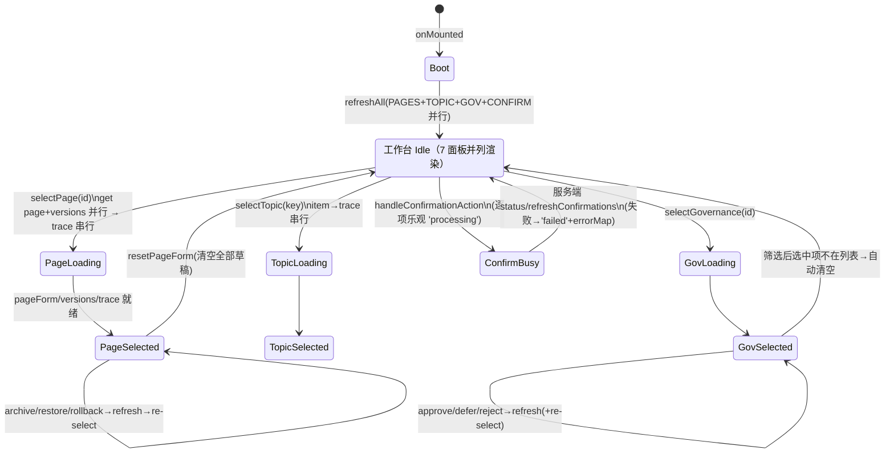

# MemoryWiki / Observe 模块重写规格

> 前端重写规格盘点（Vue3 → React + TypeScript + Mantine 9）。所有 API 路径与字段均从真实源码提取（`src/renderer/api/memory-wiki.js`、`api/observe.js`、`api/confirm.js`），未做推测。
> 请求层公共约定见 §3.0；源码阅读日期基于当前工作区版本。

---

## 1. 组件清单与职责

### 1.1 编排与 API（模块核心）

| 文件 | 行数 | 职责 | 依赖 |
| --- | --- | --- | --- |
| `composables/useMemoryWikiWorkspace.js` | 838 | **工作台编排状态机**（见 §2）：全部状态 ref、4 组筛选、35 字段 pageForm、15 个异步 action、14 个 computed 派生值、错误文案映射、slug 去重、identity 关系链路规则。组件层只留模板 | api/memory-wiki.js、api/confirm.js、api/index.js（桶导出） |
| `api/memory-wiki.js` | 201 | 26 个 memory-wiki 域 API 封装；`listMemoryWikiPages`/`getMemoryWikiPage` 内做 id/pageId、content/body、updatedAt/lastUpdatedAt 双字段归一化 | api/shared.js |
| `api/observe.js` | 51 | 6 个观察日志 API；`listObservations` 支持透传 AbortSignal | api/shared.js |
| `api/shared.js`（支撑） | 18 | `API_BASE = http://127.0.0.1:5174/api`；`apiFetch` 统一 30s 超时 + AbortSignal 合并 + 204→null | request.js |
| `api/confirm.js`（支撑） | 20 | 确认中心 API（listConfirmations / submitConfirmationDecision / getConfirmation），被工作台确认面板使用 | api/shared.js |
| `request.js`（支撑） | 174 | 超时/取消/错误分类：`ApiError{kind: network|timeout|http|protocol}`、http 错误 message 取响应体 `JSON.error` | — |
| `syncSignals.js`（支撑） | 65 | `listenDataChanged(handler)`：window CustomEvent `cornie:data-changed` + `window.cornieDesktop` 跨窗口广播；domain 包括 `memory`（memory_wiki./memory_index./memory_governance. 工具触发）与 `observation` | — |
| `composables/useRequestGuard.js`（支撑） | 44 | 竞态守卫：按 key 计序 token + AbortController，旧响应不得覆盖新状态；卸载自动 abort | — |
| `composables/useTimers.js`（支撑） | 59 | `useDebouncedValue(valueRef, ms, cb)`（220ms 搜索防抖）、`useInterval`；卸载自动清理 | — |

### 1.2 MemoryWiki 前台（路由 `/memory`）

| 组件 | 行数 | 职责 | 依赖 |
| --- | --- | --- | --- |
| `MemoryWikiHome.vue` | 303 | **前台双栏容器**：左 260px 树 + 右正文。自持一份页面数据（active + archived 各 `limit 500` 两次拉取合并）、220ms 防抖搜索（标题/别名/摘要）、localStorage 持久化选中与展开（key `cornie.memory-wiki.tree`）、`listenDataChanged(detail.memory)` 自动刷新。状态：`pages/selectedId/creating/expandedKeys/searchQuery` | MemoryWikiTree、**MemoryPageDetail.vue（658 行，本清单外但强依赖：前台阅读/编辑/新建/归档=删除，emit open-observation→`/observe/detail/:id`、open-chat-source→`/chat/day/:date?focus=`、open-memory）** |
| `MemoryWikiTree.vue` | 204 | 纯展示文件树：扁平页面列表 → `类型目录 → 页面` 一级树。固定目录序（identity_profile 关于你 → identity_person 重要的人 → identity_preference 你的偏好 → identity_trait 你的特征 → event/topic/goal/project/routine/need → other 其他；未知类型归"其他"；archived 独立灰显目录且空则隐藏）。组内按 title zh-Hans-CN localeCompare。受控展开（`expandedKeys` 数组 + `@toggle`）或内部 Set 自治。空目录显示"（空）"，展开后显示占位行。 | 无（纯 props/emit） |
| `MemoryWikiWorkspace.vue` | 213 | **治理工作台组合根**（挂在 设置→高级设置→`advancedMode` 开启后 → "记忆治理工作台" 卡片内，见 AdvancedSettings.vue:55）。只做 7 个面板的 props 接线，无模板逻辑 | useMemoryWikiWorkspace + 7 个子面板 |
| `MemoryWikiWorkspaceHead.vue` | 54 | 工作台头：标题 +「运行巡检入池」「刷新全部」两个按钮（saving/loading 禁用切换文案） | — |
| `MemoryWikiPageListPanel.vue` | 100 | 页面列表卡：类型/状态两个 `<select>` 筛选（change 时 emit update + change 触发父刷新）、页面行（title + `pageType · status · importance`）、空态 | UiCard、UiEmpty |
| `MemoryWikiPageEditorPanel.vue` | 496 | **最大面板**。35 字段 pageForm（`defineModel` 双向）；按 pageType 条件渲染四组 identity 字段（profile 9 字段 / preference 7 / person 8 / trait 8）+ 公共字段（标题/摘要/正文/别名/重要性/类型/状态/pageId 只读）。动作行：保存、归档（status≠archived）、恢复（=archived）、回滚（disabled=saving‖!selectedVersionId）。下方三段：来源追溯（relatedPages/chatSources/observationSources 摘要+卡片）；Identity 关系链路（规则文案、multiple select 关联页、保存链路、推荐补链、治理警告、关联异常）；identity_person 专属「联动 Topic」表单（keyword/别名/备注/沿用 importance） | UiCard；defineModel ×4 |
| `MemoryWikiVersionPanel.vue` | 138 | 版本历史与回滚（整行 span2）：左版本列表（reason/versionId/createdAt，点击即拉 diff），右已选版本详情 + diff 摘要（titleChanged/summaryChanged/bodyChanged/statusChanged/importanceChanged 五个布尔）+ 提示"回滚后将把当前页面恢复到这个历史快照"。**注意：回滚按钮在编辑面板，不在这里** | UiCard、UiEmpty |
| `MemoryWikiTopicIndexPanel.vue` | 124 | Topic 索引（span2）：左列表（keyword、`heat {heatScore} · {pageIds.length} pages`），右详情（normalizedKey/heatScore/dates/pageIds + topicSourceTrace 的聊天/观察来源摘要）+ 别名编辑（逗号分隔字符串，直接 v-model 在 topicDetail 上）+ 保存按钮 | UiCard、UiEmpty；defineModel(topicDetail) |
| `MemoryWikiGovernanceQueuePanel.vue` | 117 | 治理队列卡：状态筛选（pending 默认）、分区筛选（选项来自 `governanceSections` computed = 现有 items 的 queueSection 去重）、待处理计数、筛选摘要行（`{statusLabel} · {sectionLabel} · {n} 条结果`）、请求行（title/requestType + `queueSection · status · riskLevel`） | UiCard、UiEmpty |
| `MemoryWikiGovernanceDetailPanel.vue` | 204 | 治理详情卡：标题 + 徽标行（建议/status/riskLevel）；2 列 meta 卡（状态/来源 triggerSource/分区/页面 pageIds/主题 topicKeys/筛选视角）；「为什么建议这样处理」reason；「建议动作」= payload 非空 entries 映射 `key：value`；「证据与依据」= evidence[] → summary + `JSON.stringify(item,null,2)` pre。动作：标记已处理(approved)/稍后再看(deferred)/驳回建议(rejected)，各自 disabled=saving‖已是该状态。**一键写，无二次确认** | UiCard、UiEmpty |
| `MemoryWikiConfirmationPanel.vue` | 79 | 高风险确认中心（span2）：状态筛选 + 待确认计数 + ConfirmCard 网格（auto-fit minmax 280px）。每卡状态取 `statusMap[id] ‖ confirmation.status`，错误取 `errorMap[id]` | ConfirmCard.vue（205 行：title/reason/details 按 kind=category_creation_confirmation/category_mapping_confirmation/tool_name 推导；status pill approved/rejected/failed/processing；按钮仅 status==='pending' 可点） |

### 1.3 Observe 观察日志（路由 `/observe`、`/observe/list`、`/observe/detail/:id`）

| 组件 | 行数 | 职责 | 依赖 |
| --- | --- | --- | --- |
| `ObserveMemoryHome.vue` | 265 | 观察日志首页（记忆三栏之一）：头部卡（去聊天 / 记一件小事→emit `go 'observation-list'`）；当天观察卡（`listObservations({date: today, limit: 4})`）= 2 个概览块（今日观察总数、最多类型）+ 最近记录卡网格（type 中文标签、date、content 截 96 字）。`listenDataChanged(detail.observation)` 自动刷新 | UiButton/UiBadge/UiCard/UiEmpty；utils/date `today()` |
| `ObservationList.vue` | 548 | 观察列表页（路由 `/observe/list`）：头部（返回/标题/记一件小事开关）+ **Tabs**（今天的小事 / 回翻以前）+ 新增表单卡（title/content，type 固定 `'misc'`）。今天 tab：`listObservations({date, limit:100})`，卡片可跳详情、可删（原生 `confirm()`）。回翻 tab：日期 `<input type=date>` + 类别 select + 关键词（220ms 防抖）；按 date 分组渲染 + 左侧日期轨道（date/count 按钮，点击设 selectedDate）。查询参数规则：有关键词时只传 q；否则 date（≠today 时）+ from=to=selectedDate；type 可叠加；limit 200。**唯一使用 useRequestGuard 的组件**（FE-05，key='list'） | api/observe、useRequestGuard、useDebouncedValue |
| `ObservationDetail.vue` | 222 | 观察详情页（路由 `/observe/detail/:id`，props: id）：加载 `getObservation` → 就地编辑 title/content（`@input` 置 dirty，保存按钮 disabled=saving‖!dirty），保存 `updateObservation(id, {title, content, type, date})`；删除走原生 `confirm()` → emit `deleted` → App 路由回 `/observe/list`。内容 placeholder 按 type 变化（event/fact/emotion/preference 各有引导语） | UiButton/UiBadge/UiCard |

### 1.4 路由与挂载点

- `/memory` → MemoryWikiHome；`/observe` → ObserveMemoryHome；`/observe/list` → ObservationList；`/observe/detail/:id` → ObservationDetail（`router.js`，hash 模式）。
- `/memory/...` 无子路由：Home 内部用 `selectedId`/`creating` 状态切换右栏（选中页 / 新建 / 空态），不进 URL（刷新丢失选中，仅 localStorage 兜底）。
- MemoryWikiWorkspace（治理工作台）不在 `/memory` 下，而是 `设置 → /settings/advanced`（AdvancedSettings）内，需先开「高级模式」，且 AdvancedSettings 中 versions/rollback/governance/inspection/audit 5 个卡均为"即将提供"占位——治理工作台是唯一实装面板。
- 跨模块跳转集中在 App.vue `navHandlers`：`open-observation(id)`→`/observe/detail/:id`、`go('observation-list'/'observation-detail')`、`back` 链（observe/detail→observe/list→observe）、`open-chat-source({date,messageId})`→`/chat/day/:date?focus=`。

---

## 2. 工作区编排状态机（useMemoryWikiWorkspace）

### 2.1 状态分桶

```text
全局标志        loading, saving, errorMsg（整个工作台共用一个 error banner）
数据集合        pages, topicItems, governanceItems, confirmations,
               pageVersions, versionDiff, pageSourceTrace, topicSourceTrace
选中态          selectedPageId, selectedTopicKey, selectedGovernanceId, selectedVersionId
筛选态          pageFilterType, pageFilterStatus,
               governanceFilterStatus(默认'pending'), governanceFilterSection,
               confirmationFilterStatus(默认'pending')
草稿态          pageForm(35字段, createEmptyPageForm), topicDetail(+aliasesText),
               pageTopicKeyword/pageTopicAliasesText/pageTopicNote,
               relatedPageSelection
确认流逐项状态  confirmStatusMap, confirmErrorMap（key=confirmation.id）
```

**关键认知：工作台没有"面板切换"概念。** 7 个面板全部同时渲染在一个 `workspaceGrid`（两列：`minmax(260px,320px) + 1fr`，≤1120px 折为单列）中：PageList + PageEditor 占第一行两栏，Version / TopicIndex / GovernanceQueue + GovernanceDetail / Confirmation 依次向下铺（后四者整行 span2）。所谓"面板切换"是每个面板内部 **未选中→空态 / 选中→详情** 的两态切换，由 `selectedPageId / selectedTopicKey / selectedGovernanceId / pageForm.pageId` 驱动。

### 2.2 选中与加载流

| 触发 | 动作序列 | 落点状态 |
| --- | --- | --- |
| `onMounted → refreshAll` | `Promise.all([refreshPages, refreshTopicItems, refreshGovernanceItems, refreshConfirmations])`，loading 包裹，错误进 errorMsg | 4 组列表就绪 |
| `selectPage(pageId)` | ①置 selectedPageId ②`Promise.all(getMemoryWikiPage, listMemoryWikiPageVersions)` ③重置 selectedVersionId=''、versionDiff=null、pageSourceTrace=null ④pageForm ← page 全字段映射（triggerKeywords/aliases 数组→逗号串）⑤pageTopicKeyword/Aliases/Note ← title/aliases/summary ⑥**再串行** `getMemoryWikiPageSourceTrace(pageId)` ⑦relatedPageSelection ← trace.page.relatedPageIds 拷贝 | pageForm + pageVersions + pageSourceTrace 就绪 |
| `selectTopic(key)` | ①置 selectedTopicKey ②`getTopicIndexItem` ③**串行** `getTopicIndexSourceTrace`（未并行） ④topicDetail ← item + aliasesText | topicDetail + topicSourceTrace |
| `selectGovernance(requestId)` | 置 selectedGovernanceId → `getMemoryWikiGovernanceRequest` | governanceDetail |
| `selectVersion(versionId)` | 置 selectedVersionId → `getMemoryWikiPageVersionDiff(pageId, {fromVersionId: versionId, toVersionId: 'current'})`（458 号注释：对比"所选历史版本 vs 当前页"，修过版本自比恒无变更的 bug） | versionDiff |
| `refreshGovernanceItems`（尾随逻辑） | 刷新后若 selectedGovernanceId 不在新结果中 → **governanceDetail=null、selectedGovernanceId=''**（选中被筛掉即清详情） | — |

### 2.2 写入流（全部"改完刷新"，无乐观更新，除确认流）

| Action | 序列 |
| --- | --- |
| `savePage` | 校验 title 非空 → **客户端 slug 去重**（`buildWorkspaceSlug` 归一化后与 pages 里同 pageType 其他页比对）→ `pageId ? updateMemoryWikiPage : createMemoryWikiPage`（create 后 selectedPageId=新 id）→ **串行四连写**：updateMemoryWikiAliases → setMemoryWikiStatus → setMemoryWikiImportance → selectPage(finalPageId) → refreshPages + refreshTopicItems |
| `archivePage` / `restorePage` | 对应 API → refreshPages → selectPage(同页) |
| `rollbackPage` | 依赖 `pageForm.pageId && selectedVersionId` → rollbackMemoryWikiPage → refreshPages → selectPage（重新拉详情+版本列表） |
| `saveTopicAliases` | updateTopicIndexAliases → refreshTopicItems → selectTopic(原 key) |
| `saveRelatedPages` | linkMemoryWikiRelatedPages(去重后的 relatedPageSelection) → refreshPages → selectPage |
| `linkSelectedPageToTopic` | linkMemoryWikiPageToTopic({keyword, aliases, note, importance}) → refreshPages + refreshTopicItems → selectPage → selectTopic(**keyword.trim().toLowerCase()**——normalizedKey 约定小写) |
| `runInspectionScan` | enqueueMemoryWikiInspectionScan → refreshGovernanceItems |
| `changeGovernanceStatus(id, status)` | updateMemoryWikiGovernanceRequestStatus → refreshGovernanceItems → 若 id===selectedGovernanceId 再 selectGovernance（重拉详情） |
| `handleConfirmationAction(action, c)` | **唯一的逐项乐观更新**：置 `confirmStatusMap[id]='processing'`（注意源码 708 行 `action === 'approve' ? 'processing' : 'processing'` 两分支相同）、清 errorMap → `submitConfirmationDecision(id, action)` → 结果 status 取 `result.confirmation?.status ?? result.followupConfirmation?.status ?? (approve?'approved':'rejected')` → 刷新列表；失败置 `'failed'` + errorMap[id]=message |

### 2.3 状态图（主流程）



### 2.4 派生 computed（重写时需一并迁移的业务规则）

- `selectedPage` / `selectedVersion`：从集合按 id 反查。
- `governanceSections`：items 的 queueSection 去重（驱动分区筛选）。
- `pendingGovernanceCount` / `pendingConfirmationCount`：status==='pending' 计数。
- `governanceFilterSummary`：`'{状态} · {分区} · {n} 条结果'`。
- `governanceEvidenceItems`：`governanceDetail.evidence[]` → `{id, summary, body}`；summary 按 `issueType → duplicateScore → suggestion.action → 首键` 降级取值；body 为 `JSON.stringify(item, null, 2)`。
- `governanceSuggestedActions`：payload 非空 entries → `'key：value'` 字符串。
- identity 关系链路：`identityPageOptions`（非自身、pageType 以 identity_ 开头）→ `identityRelationshipRules`（4 类页型的固定建议文案表）→ `identityRelationshipCandidates`（按页型给出推荐关联类型组合并标记 linked）→ `identityRelationshipWarnings`（person/preference/trait 未挂 profile、profile 孤立等 4 条警告）→ `relatedPageIssues`（trace.relatedIssues 直通）。
- `formatWorkspaceError`：8 条后端错误串→中文文案映射（already exists / frontmatter 3 类 / unsupported type / not found / Failed to fetch→"无法连接后端服务"）。
- `formatWorkspaceError` + `buildWorkspaceSlug`（lowercase、去引号、非 [a-z0-9中文]→'-'、收缩连字符）构成客户端重复标题防护。

---

## 3. API 契约清单

### 3.0 公共约定

- Base：`http://127.0.0.1:5174/api`（`api/shared.js`）；JSON 请求头；30s 默认超时；204→null；非 2xx 抛 `ApiError('http')`（message 取响应体 `error` 字段）；外部 signal 可透传（仅 observe 的 list 使用了）。
- 以下"调用方"指当前 renderer 内真实引用（经 api/index.js 桶导出）。**标注【无调用方】的 5 个函数为已导出但前端未使用的保留契约**。

### 3.1 memory-wiki 域（api/memory-wiki.js + api/confirm.js 中被工作台使用的部分）

| 方法 | 路径 | 关键请求字段 | 关键响应字段 | 调用方 |
| --- | --- | --- | --- | --- |
| GET | `/memory-wiki/pages?pageType&status&limit&offset` | pageType、status(active/inactive/archived)、limit、offset | `items[]`（pageId/id、pageType、title、slug、status、importance、summary、content/body、aliasesText、triggerKeywords[]、ownerConfirmed、updatedAt/lastUpdatedAt；归一化后同时暴露 items+pages） | useMemoryWikiWorkspace.refreshPages；MemoryWikiHome.refresh（active 与 archived 各 limit=500 两次调用） |
| GET | `/memory-wiki/pages/{pageId}` | — | `{page:{...}}`：同上全字段 + identity 各类型专属字段（userName/preferredName/cornieRelationship/identitySummary/lifeStageSummary/currentFocus/stressors/communicationPreference、personName/relationshipToUser/roleSummary/personalitySummary/sharedExperienceSummary/emotionalWeight/timelineSummary/firstKnownPeriod、preferenceType/stance/stabilityLevel/traitType/confidenceLevel/traitSummary/evidenceCount/ownerConfirmed/lastConfirmedAt）+ triggerKeywords[]、aliases[]、body、status、importance | composable.selectPage；MemoryPageDetail.loadPage |
| GET | `/memory-wiki/pages/{pageId}/source-trace` | — | `{trace:{page:{relatedPageIds[]}, relatedPages:[{pageId,title,pageType}], chatSources:[{date,messageId,title,preview}], observationSources:[{observationId,title,preview}], relatedIssues:[{issueType,relatedPageId,message}]}}` | composable.selectPage；MemoryPageDetail.loadPage |
| GET | `/memory-wiki/pages/{pageId}/versions` | — | `{items:[{versionId, reason, createdAt}]}` | composable.selectPage |
| GET | `/memory-wiki/pages/{pageId}/version-diff?fromVersionId&toVersionId` | fromVersionId（历史版本）、toVersionId（前端固定传 `'current'`） | `{diff:{titleChanged, summaryChanged, bodyChanged, statusChanged, importanceChanged, …布尔标志}}`（UI 仅消费 5 个布尔，未见 before/after 正文） | composable.selectVersion |
| POST | `/memory-wiki/pages` | 完整 payload：pageType、title、identity 全字段、evidenceCount、ownerConfirmed、lastConfirmedAt、triggerKeywords[]、summary、body（content 会归一化为 body） | `{page:{pageId,…}}` | composable.savePage（新建分支）；MemoryPageDetail.save |
| PUT | `/memory-wiki/pages/{pageId}` | 同 POST payload | — | composable.savePage；MemoryPageDetail.save |
| PUT | `/memory-wiki/pages/{pageId}/summary` | `{summary}` | — | 【无调用方】 |
| PUT | `/memory-wiki/pages/{pageId}/aliases` | `{aliases: string[]}` | — | composable.savePage（保存后固定调用） |
| PUT | `/memory-wiki/pages/{pageId}/status` | `{status}`（active/inactive/archived） | — | composable.savePage |
| PUT | `/memory-wiki/pages/{pageId}/importance` | `{importance}`（low/medium/high/critical） | — | composable.savePage |
| POST | `/memory-wiki/pages/{pageId}/archive` | — | — | composable.archivePage；MemoryPageDetail（前台"删除"实为归档） |
| POST | `/memory-wiki/pages/{pageId}/restore` | — | — | composable.restorePage |
| POST | `/memory-wiki/pages/{pageId}/rollback` | `{versionId}` | — | composable.rollbackPage |
| POST | `/memory-wiki/pages/merge` | payload（未定形） | — | 【无调用方】 |
| PUT | `/memory-wiki/pages/{pageId}/related-pages` | `{relatedPageIds: string[]}` | — | composable.saveRelatedPages |
| POST | `/memory-wiki/pages/{pageId}/link-topic` | `{keyword, aliases[], note, importance}` | — | composable.linkSelectedPageToTopic |
| GET | `/memory-wiki/topic-index` | — | `{items:[{normalizedKey, keyword, heatScore, pageIds[], dates[]…}]}` | composable.refreshTopicItems |
| GET | `/memory-wiki/topic-index/{normalizedKey}` | —（normalizedKey 为小写约定） | `{item:{normalizedKey, keyword, aliases[], heatScore, dates[], pageIds/memoryPageIds}}` | composable.selectTopic |
| GET | `/memory-wiki/topic-index/{normalizedKey}/source-trace` | — | `{trace:{chatSources[], observationSources[]}}` | composable.selectTopic |
| PUT | `/memory-wiki/topic-index/{normalizedKey}/aliases` | `{aliases[]}` | — | composable.saveTopicAliases |
| POST | `/memory-wiki/topic-index/{normalizedKey}/link-page` | `{pageId}` | — | 【无调用方】（联动走的是 pages 侧 link-topic） |
| GET | `/memory-wiki/governance?status&requestType&triggerSource&queueSection` | status（pending/approved/rejected/deferred）、queueSection | `{items:[{requestId, title, requestType, queueSection, status, riskLevel, …}]}` | composable.refreshGovernanceItems |
| GET | `/memory-wiki/governance/{requestId}` | — | `{item:{requestId, title, requestType, status, riskLevel, triggerSource, queueSection, pageIds[], topicKeys[], reason, payload{}, evidence[]}}` | composable.selectGovernance |
| PUT | `/memory-wiki/governance/{requestId}/status` | `{status}`（approved/deferred/rejected） | — | composable.changeGovernanceStatus |
| POST | `/memory-wiki/governance/inspection-scan` | — | — | composable.runInspectionScan |
| GET | `/confirmations?date&status`（api/confirm.js） | status（pending/approved/rejected） | `{confirmations:[{id, status, confirmRequest{kind,title,reason,details[],domain,proposedCategoryName,recommendedCategory,similarCandidates[],pendingAction,toolName/toolName,payload/arguments}}]}` | composable.refreshConfirmations |
| POST | `/confirmations/{id}/decision`（api/confirm.js） | `{decision: 'approve' \| 'reject'}` | `{confirmation?, followupConfirmation?}`（followup 为二级确认，如工具继续执行） | composable.handleConfirmationAction |
| GET | `/confirmations/{id}` | — | `{confirmation}` | 【无调用方】 |

### 3.2 observe 域（api/observe.js）

| 方法 | 路径 | 关键请求字段 | 关键响应字段 | 调用方 |
| --- | --- | --- | --- | --- |
| GET | `/observations?date&from&to&type&q&limit` | date（单日）；from+to（区间，现前端固定传同值）；type（event/fact/emotion/preference/misc）；q（关键词）；limit；**支持 AbortSignal** | `{observations:[{id, date, type, title, content}]}` | ObserveMemoryHome（date=today, limit=4）；ObservationList（today: date+limit=100；回翻: from=to=selectedDate、type、q、limit=200） |
| GET | `/observations/recall?date&from&to&type&q&topic&person&limit` | topic、person 为 recall 专属 | 同上（推测含召回排序） | 【无 renderer 调用方】（可能供后端/chat 工具使用） |
| GET | `/observations/{id}` | — | `{observation:{id, date, type, title, content}}` | ObservationDetail |
| POST | `/observations` | `{title, content, type}`（列表新增固定 type='misc'） | — | ObservationList.addObservation |
| PUT | `/observations/{id}` | `{title, content, type, date}` | `{observation}`（保存后以响应回写本地状态） | ObservationDetail.save |
| DELETE | `/observations/{id}` | — | — | ObservationList.removeObservation、ObservationDetail.remove（均先走原生 confirm()） |

---

## 4. UI → Mantine 9 组件映射表

> 依据：[Mantine Tree 文档](https://mantine.dev/core/tree/)（`useTree` 受控展开/选中、`renderNode(level/expanded/hasChildren/selected/node/elementProps/tree)`、`getTreeExpandedState`/`filterTreeData` 工具）；[v9.2.0 引入 TreeSelect](https://mantine.dev/changelog/9-2-0/)（single/multiple/checkbox 三种选择模式）；[v9.4.0 引入 EmptyState](https://mantine.dev/changelog/9-4-0/)；[v9.0.0 renderPill/Generic Groups](https://mantine.dev/changelog/9-0-0/)。

### 4.1 基础 UI 与横切

| 现状（Vue） | Mantine 9 替代 | 说明 |
| --- | --- | --- |
| `ui/UiCard.vue`（title+actions slot） | `Card` + `Card.Section`（或 `Paper` + `Group` 头部） | actions slot → Card.Section 内 `Group justify="space-between"` |
| `ui/UiButton.vue`（default/ghost/dangerGhost/sm） | `Button`（default→variant="filled"；ghost→variant="subtle"；dangerGhost→color="red" variant="subtle"；size="compact-sm"） | loading 态可直接用 `Button loading` |
| `ui/UiBadge.vue` | `Badge`（variant/color 按 type/status 映射） | 观察类型、版本状态、治理徽标 |
| `ui/UiEmpty.vue`（icon+text+action slot） | `EmptyState`（v9.4+，支持 size xs–xl） | 全模块 10+ 处空态统一收编；action slot → EmptyState 子节点 |
| `ui/UiSkeleton.vue` | `Skeleton` | 现模块几乎没用骨架屏，重写补上（见 §6） |
| `ui/UiScrollArea.vue` | `ScrollArea`（/ `ScrollArea.Autosize`） | 列表滚动容器 |
| 错误横幅（workspaceError / olistError） | `Alert` color="red" variant="light" + `@mantine/notifications` | 一次性操作失败建议 notifications.show；常驻错误用 Alert |
| `useDebouncedValue`（自写 220ms） | `@mantine/hooks useDebouncedValue`（同名同语义） | 直接替换 |
| localStorage 选中/展开持久化 | `@mantine/hooks useLocalStorage` | 保持 key `cornie.memory-wiki.tree` 兼容或做迁移 |
| `listenDataChanged`（window CustomEvent + cornieDesktop 广播） | 自写 `useDataChanged(domain)` hook | **无 Mantine 等价物，必须自写**（见 §5） |
| `useRequestGuard` | 自写 hook（AbortController + token 计数） | @mantine/hooks 无等价物；逻辑可 1:1 移植为 TS |
| 原生 `confirm()`（删观察） | `@mantine/modals openConfirmModal` | 需新增 @mantine/modals 依赖；MantineProvider 挂 ModalsProvider |

### 4.2 MemoryWikiHome + Tree（前台）

| 现状 | Mantine 9 替代 | 评估结论 |
| --- | --- | --- |
| 双栏 grid `260px + 1fr`（≤760px 单列） | `AppShell`（navbar={{width: 260}}）或 `Grid`/`SimpleGrid` | 前台树常驻，建议 AppShell Navbar；若做进 Tabs 体系则 Grid |
| 搜索输入（220ms 防抖、标题/别名/摘要匹配） | `TextInput`（leftSection 图标）+ `useDebouncedValue` | 搜索提示行"搜索结果：N 条"→ `Text c="dimmed"`；可配合 `Highlight` 高亮命中 |
| `MemoryWikiTree` | **`Tree`（@mantine/core，v7.5+ 起持续增强，v9 完整可用）** | **可以接管，推荐接管**。数据映射：TYPE_ORDER 11 个固定目录 + 条件性"已归档"目录 → `TreeNodeData[]`（`{value: groupKey, label, children: pages.map(...)}`），叶子 value=pageId。受控点全部齐备：`useTree({initialExpandedState})` + `expandedIds/onExpand`（外部持久化）、`selectOnClick` + `selectedIds`、`renderNode(payload)` 定制。**必须写 renderNode** 的原因：①文件夹开合图标 ②目录计数 Badge ③空目录"（空）"与展开占位"还没有这一类的记忆" ④已归档灰显样式 ⑤title 缺省"未命名记忆"。已知边界：`children: []` 的节点 `hasChildren=false`、默认无开合行为（renderNode payload 明确 hasChildren 依据"非空 children 或 hasChildren 属性"），空目录可展开的旧行为需给目录节点塞占位子节点或在 renderNode 内手动 `tree.toggleExpanded`。搜索过滤可用官方 `filterTreeData` + 搜索时 `getTreeExpandedState(data,'*')` 全展开。 |
| `TreeSelect` | **本模块不需要** | TreeSelect 是下拉树选择器（v9.2+），用途在编辑面板的多选场景（见下），不是这棵导航树 |
| 右栏 MemoryPageDetail 读/编辑两态 | `Card` + `TextInput/Textarea` + Tabs（阅读/编辑）或 `SegmentedControl` 切 mode | MemoryPageDetail 需另行盘点（本清单外），契约见 §1.2 依赖注 |
| 右栏空态 📖"选择左侧记忆查看" | `EmptyState` | — |

### 4.3 治理工作台（MemoryWikiWorkspace 7 面板）

**整体布局评估**：现状是 7 面板全部纵向堆叠（grid 两行 + 4 个整行卡），页面极长。重写建议二选一：
- 方案 A（保真）：`Grid` 两列 + `Stack`，逐面板移植——改动最小；
- 方案 B（推荐）：`AppShell` 左列 = PageList + GovernanceQueue（二级导航/列表区），右侧 `Tabs`（页面编辑 | 版本历史 | 主题索引 | 治理详情 | 确认中心），Tabs 数量可由各面板 pending Badge（`Indicator`/`Badge`）提示。状态筛选（status/section/confirmation status）用 `SegmentedControl`（≤4 项）或 `Select`（动态 sections）。

| 现状面板/元素 | Mantine 9 替代 | 说明 |
| --- | --- | --- |
| WorkspaceHead（标题+2 按钮） | `Group justify="space-between"` + `Title` + `Button`（loading 属性） | — |
| PageListPanel：类型/状态 `<select>` | `Select`（data 常量数组，clearable） | 筛选变更触发刷新：React 中合并为 `onChange` 单回调 |
| PageListPanel：页面行按钮列表 | `UnstyledButton` + `Stack`（保真）或 `Table`（方案 B） | active 高亮 → `data-active` + CSS module |
| PageEditorPanel：35 字段条件表单 | **`@mantine/form useForm({initialValues, validate})`** + `Grid`（span2 → `Grid.Col span={12}`） | 逐控件：文本 `TextInput`、长文 `Textarea`、枚举 `Select`、数字 `NumberInput`（evidenceCount）、布尔 ownerConfirmed（现为 true/false 下拉）→ `Switch`、**triggerKeywordsText / aliasesText 逗号分隔串 → `TagsInput`**（v9 支持 renderPill） |
| PageEditorPanel：pageType/status 选择 | `Select` / `SegmentedControl`（status 仅 3 值） | pageType 9 项用 Select |
| PageEditorPanel：关联 Identity 页面（native multiple select size=6） | `MultiSelect`；**进阶：`TreeSelect` multiple/checkbox 模式（v9.2+）按 identity 类型分组** | 后者与"identity 关系链路"语义更贴合，可直接展示已关联/可补充（renderNode 定制） |
| PageEditorPanel：推荐补链/治理警告/关联异常 | `Alert`（warning → color="orange/red" variant="light"）、`List` | 警告条现状是 danger-soft 行块 |
| PageEditorPanel：来源追溯 evidence 卡片 | `Paper` + `Text`（preview）或 `Accordion`（可折叠聊天片段/观察记录） | — |
| VersionPanel：版本列表 | `Table`（versionId/reason/createdAt，行选中态）或 `Timeline`（语义更贴"历史"） | 点击行为=selectVersion 拉取 diff |
| VersionPanel：diff 展示（5 个布尔标志） | 短期：`Table`（字段×"是/否" Badge）；真 diff：**自写**（见 §5） | 现契约无 before/after 正文，字段级 diff 需后端补数据 |
| VersionPanel：回滚动作（在编辑面板） | `@mantine/modals openConfirmModal` 二次确认 → `Button` | 现状 disabled=saving‖!selectedVersionId，无确认弹窗 |
| TopicIndexPanel：列表+详情 | 同 PageList 结构：`Select` 侧栏或 `Table` + 详情 `Card`；heatScore → `Badge`/`Progress`；别名编辑 → `TagsInput` | topicDetail 为 defineModel 直改对象 → React 改为受控 state |
| GovernanceQueuePanel：状态/分区筛选 | `SegmentedControl`（4 状态）+ `Select`（动态 sections） | pendingCount → `Indicator` 或 `Badge variant="filled"`；filterSummary → `Note`/`Alert` |
| GovernanceQueuePanel：请求行 | `Table` + `Badge`（status/riskLevel 色）+ `Menu`（行内"通过/暂缓/驳回"快捷动作）+ `openConfirmModal` 确认 | **任务点名的 Table+Badge+Menu+Modal 组合**；现状点击行仅选中，动作在详情面板一键写——建议补 Modal 确认（见 §6） |
| GovernanceDetailPanel：徽标行/meta 网格 | `Group` + `Badge`；meta 2 列卡 → `SimpleGrid cols={2}`（≤720px 1 列，组件自身响应式） | — |
| GovernanceDetailPanel：reason 大段文本 | `Text` + `whitespace-pre-wrap`（或 `Paper`） | — |
| GovernanceDetailPanel：evidence JSON `<pre>` | `@mantine/code-highlight` 的 `CodeHighlightBlock`（v8 起替代 @mantine/prism）或 `Code block` | 若不引新包，`Paper`+`<pre>` 保真即可 |
| GovernanceDetailPanel：动作行 | `Button.Group` + disabled 语义照搬（approved→approve 禁用等） | **建议 reject 加确认** |
| ConfirmationPanel：确认卡网格 auto-fit 280px | `SimpleGrid`（`minChildSize` / `spacing`，v9 语义化 cols） | — |
| ConfirmCard：状态 pill / 详情行 / 错误 / 按钮 | `Badge`（approved→green, rejected/failed→red, processing→yellow, pending→default）、`List`、`Alert color="red"`、`Button`（仅 pending 可点） | statusMap/errorMap 逐项状态保留为组件内 state 或 reducer |

### 4.3 Observe 三页

| 现状 | Mantine 9 替代 | 说明 |
| --- | --- | --- |
| ObserveMemoryHome 头部/概览/卡片 | `Card` + `Button` + `Badge`；概览 2 块 → `Paper` + `ThemeIcon`/大号 `Text`（Mantine 无 Stat 组件） | 记一件小事 → `router` 跳转保留 |
| 最近观察卡网格（≤720px 单列） | `SimpleGrid cols={{base:1, sm:2}}` | — |
| ObservationList：今天/回翻 Tabs | `Tabs`（或 `SegmentedControl`——仅 2 项更轻） | tab 切换触发 refresh，React 里用 useEffect 依赖驱动 |
| 日期筛选 `<input type=date>` | `@mantine/dates DatePickerInput`（**需新增依赖**）或保真原生 input | @mantine/dates 未在任务包列表内，按需引入 |
| 类别筛选 | `Select` | — |
| 关键词防抖搜索 | `TextInput` + `@mantine/hooks useDebouncedValue`（220ms） | 与现实现语义一致 |
| 今天列表卡 / 删除 | `Card`（onClick 跳详情）+ `Menu` 或 `Button` + `openConfirmModal` | 替换原生 confirm() |
| 回翻：日期轨道 + 分组列表 | 轨道 → `NavLink`/`UnstyledButton` 列表（`ScrollArea`）；分组 → `Stack` + 日期 `Divider`/`Title order` | — |
| ObservationDetail 编辑表单 | `TextInput` + `Textarea` + `@mantine/form`（`form.isDirty()` 替代手写 dirty ref）；date/type 只读展示 → `Badge` | 保存按钮 disabled=saving‖!dirty 保持 |
| 删除确认 | `openConfirmModal` | 现为原生 confirm() |

---

## 5. 必须自写的部分

1. **版本 diff 视图**（前端完全自写）：现 UI 只渲染后端 diff 的 5 个布尔标志（titleChanged/summaryChanged/bodyChanged/statusChanged/importanceChanged），**没有任何字段级内容对比**。若重写要真 diff：a) 需后端在 version-diff 响应中补 before/after 正文（契约现状不含）；或 b) 前端用 `jsdiff`/`diff-match-patch` 对快照正文计算——但 versions 列表项也只含 versionId/reason/createdAt，**快照正文前端拿不到**。重写前必须与后端确认版本快照是否含 body。UI 呈现（两栏对齐、行内高亮）Mantine 无现成组件。
2. **Tree 的 `renderNode` 定制渲染**：目录图标（开/合）、计数 Badge、空目录"（空）"与占位行、已归档灰显、active 加粗高亮、title 空值兜底"未命名记忆"——全部进 renderNode；空目录可展开这一行为需要占位子节点或手动 toggle 逻辑。
3. **`useRequestGuard` 等价竞态守卫 hook**：token 计数 + AbortController + 卸载自动 abort。ObservationList 已用；工作台 composable 尚未接入（见 §6.1），重写时应统一。
4. **`useDataChanged` 跨窗口数据同步 hook**：`syncSignals.js` 的 `cornie:data-changed` CustomEvent + `window.cornieDesktop.broadcastDataChanged/onDataChanged` 桥 + `collectChangedDomains` 按 tool_name 前缀归域（memory/observation…）。React 版必须保留该事件桥（含 Electron preload 通道），否则多窗口失同步。
5. **`formatWorkspaceError` 错误文案映射表**：8 条后端错误串→中文文案，建议迁移为常量 Map + 纯函数（TS 后归入共享 utils）。
6. **identity 关系链路业务规则**：`identityRelationshipRules/Candidates/Warnings` 三组 computed（4 类页型的推荐关联类型矩阵、4 条警告文案）——纯业务逻辑，随状态机一起迁移，与 UI 无关。
7. **客户端重复标题守卫**：`buildWorkspaceSlug`（小写、去引号、非法字符转 `-`、缩连字符）+ `findDuplicatePageSummary`（同 pageType 下 slug 撞车检测）。TS 重写时保留（后端也有兜底错误，但前置校验体验更好）。
8. **治理证据摘要生成**：`buildEvidenceSummary`（issueType→duplicateScore→suggestion.action→首键 的降级摘要）+ `formatEvidence`（pretty JSON）。
9. **pageForm 的 35 字段类型定义与双向绑定**：TS interface + @mantine/form schema 是重写工作量最集中的单点（现文件 496 行里大半是表单模板）。

---

## 6. 边界与坑

### 6.1 竞态与请求守卫（最高风险）
- **治理工作台完全没有竞态守卫**：`selectPage` 先同步置 `selectedPageId`，再异步写 `pageForm/pageVersions/pageSourceTrace`；快速连点两个页面时，慢响应会覆盖新选中页的数据（selectTopic/selectGovernance 同理）。ObservationList 用 `useRequestGuard`（token+Abort）解决了同类问题——React 重写应把守卫下沉为所有 selectX 的标配，而非只做列表页。
- `refreshAll` 用 `Promise.all` 并行 4 个刷新，任一失败整块报错但其余数据已写入——React 版建议 per-domain 错误态。
- `savePage` 是**非事务四连写**：create/update → aliases → status → importance，任一中途失败页面处于半保存状态且无回滚提示；成功后还触发 selectPage（3 个 GET）。建议后端合并端点，或前端按步 notifications 反馈。
- `linkSelectedPageToTopic` 成功后 `selectTopic(keyword.trim().toLowerCase())`——normalizedKey 小写是隐式契约，别在重写时丢掉。

### 6.2 乐观更新与状态一致性
- 唯一的乐观更新在确认卡：`confirmStatusMap` 立即置 `'processing'`；源码 708 行 `action === 'approve' ? 'processing' : 'processing'` 两个分支相同（smell，但行为正确：先占位、等服务器结果覆盖，失败置 `'failed'` 并写 errorMap）。决策响应可能是 `confirmation` 或 `followupConfirmation`（二级确认，工具继续执行）——TS 响应类型要覆盖两者。
- 其余所有写操作都是"改完全量刷新"，无乐观 UI——重写可保持（简单可靠），但要补 loading/notifications 反馈。
- **治理筛选会清空选中**：`refreshGovernanceItems` 若 selectedGovernanceId 不在新结果中则同时清 `governanceDetail`。重写须保留该"详情跟随列表"语义，避免悬挂详情。
- 确认流/筛选默认值：governanceFilterStatus 与 confirmationFilterStatus 默认 `'pending'`，但页面列表筛选默认空——重写时默认值易错。

### 6.3 长列表性能
- MemoryWikiHome 拉两次 `limit=500`（active+archived，最多 1000 条）建树，无虚拟化；ObservationList limit 100/200、治理/主题列表**无 limit 参数**。Mantine `Table`/`Tree` 组件本身不内置虚拟化（官方 TreeSelect 虚拟化示例用 @tanstack/react-virtual）。当前量级可接受，但 React 版应在列表层留虚拟化插槽或分页参数（memory-wiki API 已支持 limit/offset，observe 无分页字段）。
- 树构建为纯内存 computed，重写时把"分组+排序（zh-Hans-CN localeCompare）+归档条件目录"保留为 `useMemo` 派生。

### 6.4 确认流安全策略
- 确认卡安全策略：按钮仅 `status==='pending'` 可点，处理中显示"处理中"，防重复提交——重写必须保留该状态闸门。
- **治理审核一键写、无二次确认**（approve/deferred/rejected 直接 PUT）；建议 React 版对 reject（以及回滚）加 `openConfirmModal`。
- 删除语义不一致的三种形态并存：①观察删除=真 DELETE + 原生 `confirm()`（Electron 下为阻塞式 JS 弹窗，体验差且样式不统一）；②前台记忆页"删除"=**归档**（archiveMemoryWikiPage），两步内联确认；③工作台编辑面板归档/恢复按钮一键执行。重写建议统一为 `openConfirmModal`，并把"删除=归档"文案显式化。
- 回滚流强依赖 `selectedVersionId`：按钮 disabled=`saving||!selectedVersionId`，未选版本时文案"先选择版本再回滚"；回滚成功后 selectPage 会带回新增的回滚版本记录。

### 6.5 空态与加载
- 空态矩阵 ≥10 处：未选页面（📖）/未选主题（🔍）/未选治理（📋）/未选版本（🕘）/无版本（🕐）/无页面（📄）/无主题索引（🔗）/无治理建议（🧭）/无确认（🛡️）/搜索无结果/空目录/今天无观察（📝）/无匹配小事（🗂️）。文案已定，React 用 `EmptyState` 统一收口，emoji 换图标。
- 加载态粒度极粗：工作台只有单一全局 `loading`（所有面板同时"转"），无 Skeleton。重写建议按面板/区域给 `Skeleton`（列表行骨架 + 详情骨架），保存态用 `Button loading`。
- 加载失败静默区：MemoryWikiHome 树加载失败静默为空态（无错误提示），ObservationList 有错误横幅——重写时统一错误呈现，避免"静默空态"被误解为无数据。

### 6.6 其他
- **双数据源分叉**：前台 MemoryWikiHome 自带页面加载（归一化后的 pages 字段）与 MemoryPageDetail 独立读写；治理工作台 useMemoryWikiWorkspace 又是另一套页面数据流。两者互不共享状态，仅靠 `listenDataChanged(detail.memory)` 广播对齐——React 版应合并为一个 query 层（如 TanStack Query 按 key 失效），否则重写会复制这个分叉。
- API 归一化层是历史包袱的显影：`listMemoryWikiPages`/`getMemoryWikiPage` 兼容 id↔pageId、content↔body、updatedAt↔lastUpdatedAt 双写。TS 类型应以**归一化后的字段**为契约，不要照抄后端原始字段。
- `localStorage` key `cornie.memory-wiki.tree`（{selectedId, expanded[]}）需要兼容读取或一次性迁移。
- 跨窗口同步依赖 `window.cornieDesktop.broadcastDataChanged`（Electron preload 注入），React 重写不得绕过。
- MemoryWikiWorkspace 挂在"设置→高级设置→高级模式"门后（AdvancedSettings 的 versions/rollback/governance/inspection/audit 卡片均为占位）——重写时注意入口信息架构，勿把治理工作台误迁到前台 `/memory`。
